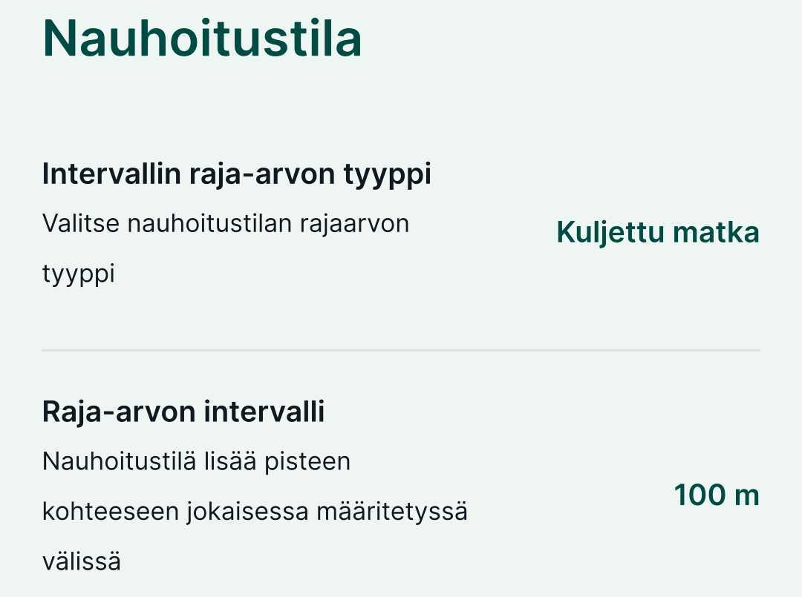
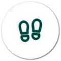

# Alueen jakaminen ja lisääminen

## Alueen lisääminen

1.  Paina alavalikon "Lisää" painikekeesta

2.  Tarkista että ylhäällä lukee "Maaperä"- taso. Jos ei lue niin vaihda tasoksi "Kohteet"

3.  Siirry kartalla haluamaasi sijaintiin ja paina alhaalta kohdasta "+ Lisää"

4.  Klikkaa alueen kulmapisteet siirtymällä kartalla haluttuun kohtaan ja painamalla "+ Lisää"

5.  Jos haluat poistaa edellisen kulmapisteen paina "- Poista" nappulaa alalaidasta. Kumoa toiminnolla, kumoat edellisen komennon.

6.  Klikkaa lopuksi alhaalta "Tallenna"

7.  Syötä tarvittavat ominaisuustiedot

8.  Valitse lopuksi oikean yläkulman vihreä ✅

<iframe src="https://drive.google.com/file/d/138h3LXy4p5KU1YNBUR1ghcCH7nmBDgmb/preview" width="100%" height="900" allowfullscreen="allowfullscreen">

</iframe>

## Alueen lisääminen nauhoitustilalla

Tarkista ensin että asetukset ovat kunnossa.

Klikkaa karttanäkymän oikean laidan "Lisää" --\> "Asetukset"

Voit halutessasi muuttaa intervallia kuljetun matkan ja ajan välillä ja antaa haluamasi raja-arvo esimerkiksi:

Kun asetukset ovaat kunnossa, toimi seuraavasti:

1.  Paina alavalikon "Lisää" painikekeesta

2.  Tarkista että ylhäällä lukee "Maaperä"- taso. Jos ei lue niin vaihda tasoksi "Kohteet"

3.  Paina näkymän jalanjälkien kuvaa:

    

4.  Valitse avautuvasta ikkunasta "Aloita nauhoitus"

5.  Liiku määritetyn kohteen ympärillä niin alue nauhoittuu sitä mukaan.

6.  Kun olet liikkunut kohteen ympäri niin napauta "Tallennus"- kohdasta ja "Lopeta nauhoitus". HUOM! toiminto sulkee alueen eli jos et ole kulkenut täysin kohdeetta ympäri sulkeutuu kohde viimeisimmästä pisteestä alkupisteeseen.

7.  Syötä tarvittavat ominaisuustiedot

8.  Valitse lopuksi oikean yläkulman vihreä ✅

<iframe src="https://drive.google.com/file/d/1_KbwjgqvTmE8v7JDTcvKvAmVPu9rQxW0/preview" width="100%" height="900" allowfullscreen="allowfullscreen">

</iframe>

Kohteelle tallennetaan tällä hetkellä seuraavat ominaisuustiedot:

\- Nimi: 

-   Multava 

-   Kalkitus 

-   Lannoitus 

-   Muu 

    

-   Valokuva

-   Lisätieto

Mikäli listasta puuttuu jokin haluttu kohde tai haluat muutoin muuttaa kohdelistausta, anna palautetta alla olevan lomakkeen avulla:

<iframe src="https://docs.google.com/forms/d/e/1FAIpQLSfsGGxcdoyVvwqIh-dGyleqlHLDa48dSnIgMMCHhSZR-pgl4Q/viewform?usp=pp_url&amp;embedded=true" width="100%" height="800" frameborder="0" marginheight="0" marginwidth="0">

Ladataan...

</iframe>

## Alueen jakaminen

<iframe src="https://drive.google.com/file/d/1RMDDmVpzrPZgOGaL7YUvy1RABSKep2Hn/preview" width="100%" height="900" allowfullscreen="allowfullscreen"></iframe>
