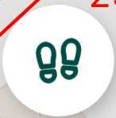

# **Alueen lisääminen ja jakaminen**

## **Alueen lisääminen**

1.  Paina alavalikosta  

2.  Tarkista, että valittuna tasona on ***Maaperä***.

3.  Siirry kartalla haluamaasi sijaintiin ja paina alhaalta 

4.  Tallenna muut alueen kulmapisteet kartalle painamalla kulmapisteen kohdalla 

5.  Jos haluat poistaa edellisen kulmapisteen paina  alalaidasta.  toiminnolla, kumoat edellisen komennon.

6.  Napauta lopuksi alhaalta  

7.  Syötä tarvittavat ominaisuustiedot.

8.  Valitse lopuksi oikean yläkulmasta  

Avaa video

<iframe src="https://drive.google.com/file/d/138h3LXy4p5KU1YNBUR1ghcCH7nmBDgmb/preview" allowfullscreen></iframe>

## **Alueen lisääminen nauhoitustilalla**

### **Nauhoitustilan asetukset**
Tarkista ensin että asetukset ovat kunnossa:

1. Paina karttanäkymän oikean laidan  → 

2. Voit halutessasi muuttaa intervallia kuljetun matkan ja ajan välillä ja antaa haluamasi raja-arvo esimerkiksi:

### **Nauhoitustila**

Kun asetukset ovat kunnossa, toimi seuraavasti:

1.  Paina alavalikon .

2.  Tarkista, että valittuna tasona on ***Maaperä***.

3.  Paina karttanäkymän jalanjälkien kuvaa 

4.  Valitse avautuvasta ikkunasta ***Aloita nauhoitus***.

5.  Alue muodostuu kulkemasi reitin mukaan.

6.  Kun olet liikkunut kohteen ympäri, paina  ja ***Lopeta nauhoitus***. Toiminto sulkee alueen eli jos et ole kulkenut kokonaan kohteen ympäri, sulkeutuu kohde viimeisimmästä pisteestä alkupisteeseen.

7.  Syötä tarvittavat ominaisuustiedot.

8.  Valitse lopuksi oikean yläkulmasta  

Avaa video

<iframe src="https://drive.google.com/file/d/1_KbwjgqvTmE8v7JDTcvKvAmVPu9rQxW0/preview" allowfullscreen></iframe>

Kohteelle tallennetaan tällä hetkellä seuraavat ominaisuustiedot:

- Kohde:
    -   Multava

    -   Kalkitus

    -   Lannoitus

    -   Vetelä

    -   Rikkakasveja

    -   Muu

-   Valokuva

-   Lisätieto

Mikäli listasta puuttuu jokin haluttu kohde tai haluat muutoin muuttaa kohdelistausta, anna palautetta alla olevan lomakkeen avulla:

[Palautelomake: Alueen lisääminen](https://docs.google.com/forms/d/e/1FAIpQLSfsGGxcdoyVvwqIh-dGyleqlHLDa48dSnIgMMCHhSZR-pgl4Q/viewform?usp=pp_url&entry.76641795=Alueen+lis%C3%A4%C3%A4mist%C3%A4)

## **Alueen jakaminen**

Tämä toiminto jakaa alueen kahdeksi erilliseksi kohteeksi, jotka säilyttävät alkuperäiset attribuutit, mutta saavat uudet tunnisteet. Tämän toiminnon jälkeen voit lisätä peltolohkoille useita kasveja samalle lohkolle,

**Toimintaohjeet**:

1.  Napauta kartalla haluamaasi aluekohdetta.

2.  Napauta -painiketta avataksesi ominaisuudet.

3.  Napauta  -painiketta. Kohteen kulmapisteet korostuvat kartalle

4.  Napauta  -painiketta.

5.  Valitse .

6.  Määritä jakolinja napauttamalla  -painiketta luodaksesi jakolinjan ensimmäinen piste. HUOM! Piste oltava jaettavan geometrian ulkopuolella

7. Lisää pisteitä määrittääksesi jakolinjan reitin.

8.  Kun jakolinja on valmis, napauta 

    Sovellus luo kaksi uutta kohdetta alkuperäisen kohteen sijaan. Molemmat uudet kohteet perivät alkuperäisen kohteen attribuutit, mutta saavat uudet tunnisteet.

Avaa video

<iframe src="https://drive.google.com/file/d/1RMDDmVpzrPZgOGaL7YUvy1RABSKep2Hn/preview" allowfullscreen></iframe>

