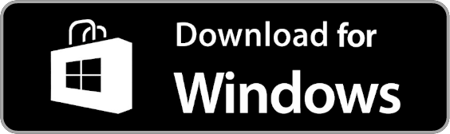
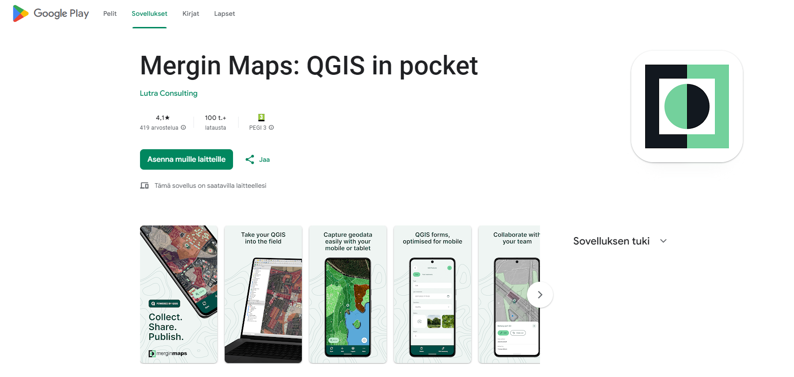

# Esittely

Ennakkovalmistelut

Lataa Mergin Maps -mobiilisovellus Android-laitteellesi, iPhonelle tai iPadille. Löydät sen laitteesi sovelluskaupasta:

 *Mergin Maps Google Play kaupassa*

## **Tuetut käyttöjärjestelmäversiot**

Mobiilisovelluksen vähimmäiskäyttöjärjestelmäversiot ovat Android 9 ja iOS 16.

## **Mergin Maps sovellus Windowsille**

Jos haluat käyttää mobiilisovellusta Windowsissa, sinun on ladattava .exe-asennusohjelma [MerginMaps/mobile](https://github.com/MerginMaps/mobile/releases/tag/2025.5.0)-arkistosta ja asennettava se tietokoneellesi.

Mobiilisovellus vaatii Windows 10- tai Windows 11 -käyttöjärjestelmän.
