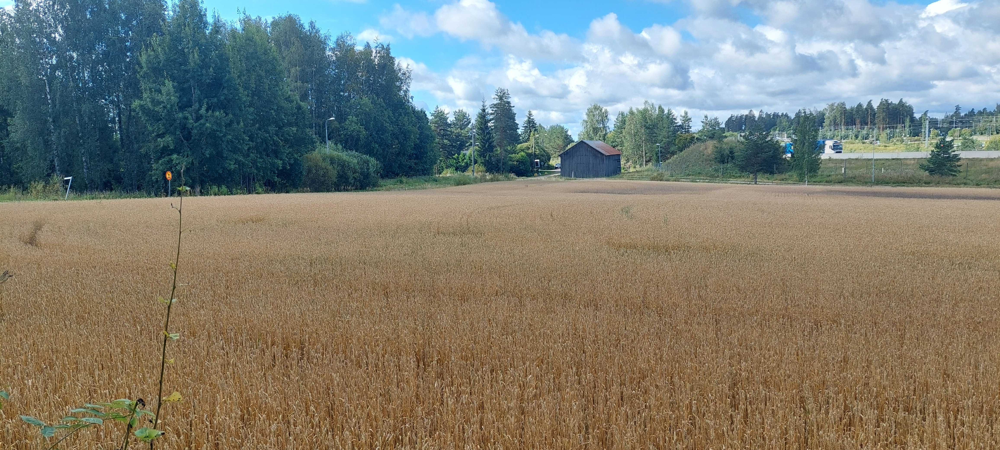

# Peltomappi
Nämä sivut sisältävät ohjeita [EIP Peltomappi](https://maaseutuverkosto.fi/hankkeet/eip-peltomappi-uusi-sovellus-maaperan-kasvukunnon-seuraamiseen-ja-kehittamiseen) -hankkeeseen liittyvään sovellusprojektiin.

## **Tiedotteet**

**5.9.2025**: Testausjakso 1. käynnistetty. Liity testaajaksi [tämän lomakkeen](https://docs.google.com/forms/d/e/1FAIpQLSeAPgEiIDn2D_Hrg1yzTanvjEgphKVZP7P2BrJzVnxL9cLgyg/viewform) avulla ja anna palautetta [täältä](https://gispocoding.github.io/eip-peltomappi/palaute.html).

