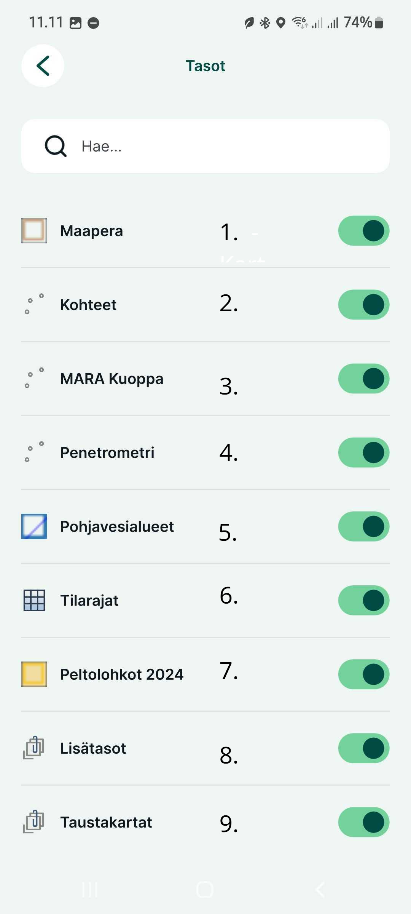
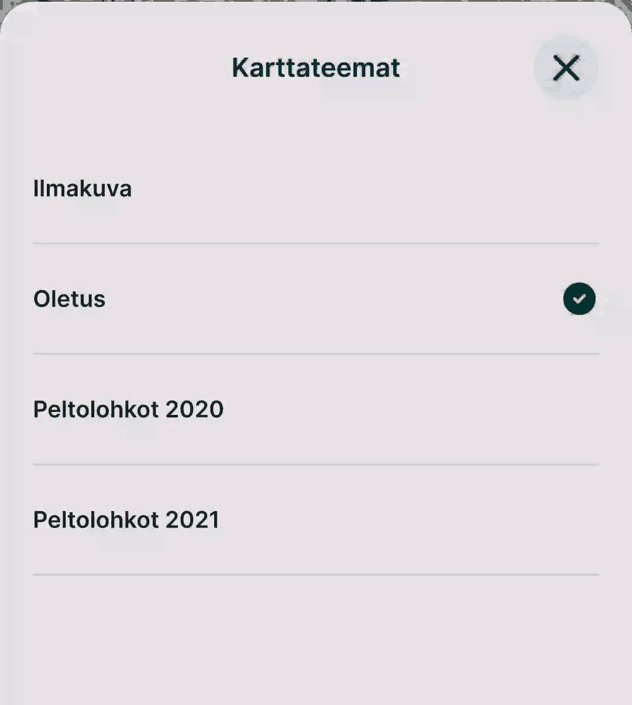

# **Karttanäkymä**

Tutustutaan aluksi Mergin Mapsin käyttöliittymään

1.  **GPS-indikaattori:** Näyttää tämän hetkisen GPS-tarkkuuden. Näpäyttämällä tätä avautuu tarkemmat [tiedot](https://gispocoding.github.io/eip-peltomappi/img/gps_info_mm.jpg). Lisätietoja [täältä](https://gispocoding.github.io/eip-peltomappi/yleiset_asetukset.html#mista-naet-gps-tarkkuuden).

2.  **Sijaintipainike:** Näytön oikeassa alakulmassa olevan sijaintipainikkeen napauttaminen keskittää kartan nykyiseen sijaintiisi ja pitää sen keskitettynä liikkuessasi. Jos siirrät karttaa manuaalisesti, automaattinen keskitystila poistuu käytöstä automaattisesti.

3.  **Synkronoi:** Näpäyttämällä tätä tiedot synkronoituvat pilveen. Lisätietoja tästä asetuksien [synkronointi kohdassa](https://gispocoding.github.io/eip-peltomappi/yleiset_asetukset.html#mergin-mapsin-synkronointi-mobiilisovelluksessa)

4.  **Lisää:** Napauta Lisää-painiketta siirtyäksesi tallennustilaan, jotta voit tallentaa uusia kohteita.

    Käytössä oleva aktiivinen taso näkyy näytön yläreunassa. Napauta sitä valitaksesi toisen aktiivisen tason projektin muokattavissa olevista tasoista.

5.  **Tasot:** Napauta Tasot-painiketta näyttääksesi projektisi tasot.

    Tässä voit ottaa käyttöön tai poistaa käytöstä tiettyjä tasoja muuttaaksesi niiden näkyvyyttä kartalla, nähdäksesi tasojen selitteet ja selataksesi tasojen ominaisuuksia.

    Seuraavassa kappaleessa lisätietoja

6.  **Lisää:** Avaa sinulle lisääasetuksia:

    -   Projektit: oikotie mobiilisovelluksen pääsivulle
    -   Zoomaa projektiin: zoomaa kaikkien projektin näkyvien tasojen laajuuteen.
    -   Karttateemat: luettelo karttateemoista
    -   Sijainnin nauhoitus: aloittaaksesi jälkien seurannan maastotutkimuksen aikana
    -   [Mittaa](https://gispocoding.github.io/eip-peltomappi/mittaus.html): mittaa pituus tai alue kartalla
    -   Paikalliset muutokset: yleiskatsaus synkronoitavista paikallisista muutoksista
    -   Asetukset: sisältää seuraavat lisäasetukset:
        -   GPS-asetukset: GPS tarkkuuden raja-arvot, Hallinnoi GPS vastaanottimia, GPS antennin korkeus
        -   Nauhoitustila: Intervallin raja-arvon tyyppi (kuljettu matka tai kulunut aika), Raja-arvon intervalli
        -   Tallennusasetukset: Käytä uudelleen viimeksi syötettyä arvoa, Synkronoi muutokset automaattisesti, Lukitse autommaatinen sijainti, kosketuspalaute
        -   Sekä yleiset viittaukset mobiilisovelluksen tietoihin, muutosloki, ohje, tietosuojakäytäntö, palveluehdot ja diagnostiikkaloki

## **Karttatasot**

Sovelluksessa on tällä hetkellä käytössä lukuisia erilaisia karttatasoja. Voit sammuttaa tasoja näkymästä klikkaamalla tason vieressä olevaa palkkia.

1.  **Maaperä:** Tälle tasolle tallennetaan kaikki aluemuotoiset kohteet. Tasolle lisäämisestä lisää kappaleessa [Alueen lisääminen ja jakaminen](https://gispocoding.github.io/eip-peltomappi/alueen_lis%C3%A4%C3%A4minen.html)
2.  **Kohteet:** Tälle tasolle tallennetaan pistemuotoiset kohteet, kuten kivet, rummut jne. Tämän tason toiminnoista lisää kappaleessa [Kohteen lisääminen](https://gispocoding.github.io/eip-peltomappi/kohteen_lis%C3%A4%C3%A4minen.html)
3.  **MARA Kuoppa:** Tälle tasolle tallennetaan kaikki MARA-testauksen tulokset. Lisätietoja tästä tasosta kappaleessa [MARA-Kuoppa](https://gispocoding.github.io/eip-peltomappi/mara_kuoppa.html)
4.  **Penetrometri:** Tälle tasolle tallennetaan Penetrometrilla saadut testitulokset. Lisätietoja tasosta kappaleeessa [Penetrometri](https://gispocoding.github.io/eip-peltomappi/penetrometri.html)
5.  **Pohjavesialueet:** Tällä tasolla on nähtävissä vedenhankintaa varten kartoitetut ja luokitellut pohjavesialueet. Aineiston toimittaja Suomen ympäristökeskus - SYKE. Lisätietoja tason aineistosta [täältä](https://ckan.ymparisto.fi/dataset/pohjavesialueet).
6.  **Tilarajat:** Tasolla Maanmittauslaitoksen kiinteistöjaotus. Aineiston toimittaa maanmittauslaitos. Lisätietoja aineistosta [täältä](https://www.maanmittauslaitos.fi/sites/maanmittauslaitos.fi/files/attachments/2020/06/Vektoritiilipalvelun%20esittely.pdf).
7.  **Peltolohkot 2024:** Ruokaviraston Paikkatietoa sisältävä kasvulohko 2024 tason aineisto. Lisätietoja tasosta [täältä](https://www.ruokavirasto.fi/tietoa-meista/julkaistut-tietoaineistot/paikkatietoaineistot/)
8.  **Lisätasot:** Lisätasoissa on muita projektin kannalta oleellisia tasoja kuten vanhemmat ruokaviraston paikkatietoa sisältävät kasvulohkot (vuosilta 2020-2023) ja reitin piirto taso (tracking_layer). Pääset katsomaan tarkemmin mitä tasoja täällä on napauttamalla tason otsikkoa.
9.  **Taustakartat:** Tasolla taustakarttoina tällä hetkellä [Maanmittauslaitoksen vektoritiilet maastotietokannasta](https://www.maanmittauslaitos.fi/kartat-ja-paikkatieto/aineistot-ja-rajapinnat/karttojen-rajapintapalvelut/karttakuvapalvelu-wms) ja [Kapsi Ortokuva](https://kartat.kapsi.fi/) maanmittauslaitoksen ortokuvasta. Napauttamalla tasoa näet tarkemmin mitä tietoja se sisältää.

## **Karttateemat**

Karttateemoissa on valittavana seuraavat teemat:

-   Oletus (Maanmittauslaitoksen vektoritiili)

-   Ilmakuva

-   Peltolohkot 2020

-   Peltolohkot 2021

-   Peltolohkot 2022

-   Peltolohkot 2023
