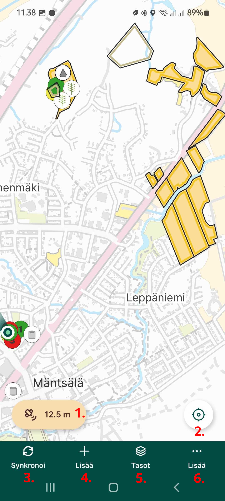

# Karttanäkymä

Tutustutaan aluksi Mergin Mapsin käyttöliittymään ja paikkatietojen tarkasteluun sillä.

-   **GPS-indikaattori:** Näyttää tämän hetkisen GPS-tarkkuuden. Näpäyttämällä tätä avautuu tarkemmat tiedot

-   **Sijaintipainike:** Näytön oikeassa alakulmassa olevan sijaintipainikkeen napauttaminen keskittää kartan nykyiseen sijaintiisi ja pitää sen keskitettynä liikkuessasi. Jos siirrät karttaa manuaalisesti, automaattinen keskitystila poistuu käytöstä automaattisesti.

-   **Synkronoi:** Näpäyttämällä tätä tiedot synkronoituvat pilveen. Lisätietoja tästä asetuksien [synkronointi kohdassa](https://gispocoding.github.io/eip-peltomappi/yleiset_asetukset.html#mergin-mapsin-synkronointi-mobiilisovelluksessa)

-   **Lisää:** Napauta Lisää-painiketta siirtyäksesi tallennustilaan, jotta voit tallentaa uusia kohteita.

    Käytössä oleva aktiivinen taso näkyy näytön yläreunassa. Napauta sitä valitaksesi toisen aktiivisen tason projektin muokattavissa olevista tasoista.

-   **Tasot:** Napauta Tasot-painiketta näyttääksesi projektisi tasot.

    Tässä voit ottaa käyttöön tai poistaa käytöstä tiettyjä tasoja muuttaaksesi niiden näkyvyyttä kartalla, nähdäksesi tasojen selitteet ja selataksesi tasojen ominaisuuksia.

-   **Lisää:** Avaa sinulle lisääasetuksia:

    -   Projektit: oikotie mobiilisovelluksen pääsivulle
    -   Zoomaa projektiin: zoomaa kaikkien projektin näkyvien tasojen laajuuteen.
    -   Karttateemat: luettelo karttateemoista
    -   Sijainnin seuranta: aloittaaksesi jälkien seurannan maastotutkimuksen aikana
    -   [Mittaa](https://gispocoding.github.io/eip-peltomappi/mittaus.html): mittaa pituus tai alue kartalla
    -   Paikalliset muutokset: yleiskatsaus synkronoitavista paikallisista muutoksista
    -   Asetukset: GPS-asetukset, nauhoitustila ja tallennusasetukset sekä yleiset viittaukset mobiilisovelluksen tietoihin, muutosloki, ohje, tietosuojakäytäntö, palveluehdot ja diagnostiikkaloki
