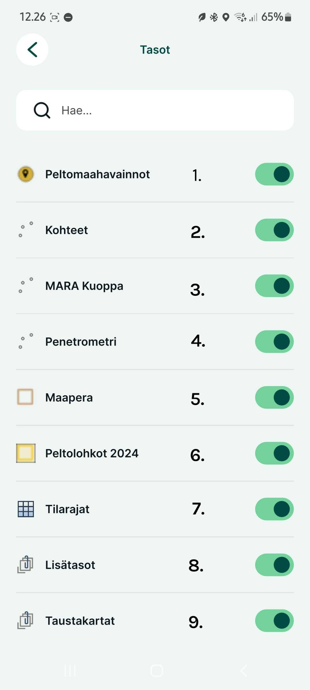

# **Karttanäkymä**

Tutustutaan aluksi Mergin Mapsin käyttöliittymään

  

1.  Näyttää tämän hetkisen GPS-tarkkuuden. Näpäyttämällä tätä avautuu tarkemmat [tiedot](https://gispocoding.github.io/eip-peltomappi/img/gps_info_mm.jpg). Lisätietoja [täältä](https://gispocoding.github.io/eip-peltomappi/yleiset_asetukset.html#mista-naet-gps-tarkkuuden).

2.   Keskittää kartan nykyiseen sijaintiisi ja pitää sen keskitettynä liikkuessasi. Jos siirrät karttaa manuaalisesti, automaattinen keskitystila poistuu käytöstä automaattisesti.

3.   Tietojen synkronointi pilveen. Lisätietoja tästä asetuksien [synkronointi kohdassa](https://gispocoding.github.io/eip-peltomappi/yleiset_asetukset.html#mergin-mapsin-synkronointi-mobiilisovelluksessa)

4.   Tallenna uusia kohteita.

    Käytössä oleva aktiivinen taso näkyy näytön yläreunassa. Napauta sitä valitaksesi toisen aktiivisen tason projektin muokattavissa olevista tasoista.

5.   Projektisi tasovalikko, josta voit laittaa tasoja päälle ja pois manuaalisesti.
Seuraavassa kappaleessa lisätietoja eri tasoista

6.   Lisäasetuksia:

    -   : oikotie mobiilisovelluksen pääsivulle
    -   : zoomaa kaikkien projektin näkyvien tasojen laajuuteen.
    -   : [luettelo karttateemoista](https://gispocoding.github.io/eip-peltomappi/karttan%C3%A4kym%C3%A4.html#karttateemat)
    -   : aloittaaksesi reitin piirron liikkumasi sijainnin perusteella. Lue lisää [täältä](https://gispocoding.github.io/eip-peltomappi/reitin_nauhoitus.html)
    -   : mittaa pituus tai alue kartalla. Lisää [täältä](https://gispocoding.github.io/eip-peltomappi/mittaus.html)
    -   : yleiskatsaus synkronoitavista paikallisista muutoksista, joita ei siis ole vielä siirretty pilvipalveluun. 
    -   : lisäasetuksia kuten:
        -   GPS-asetukset: GPS tarkkuuden raja-arvot, Hallinnoi GPS vastaanottimia, GPS antennin korkeus
        -   [Nauhoitustila](https://gispocoding.github.io/eip-peltomappi/reitin_nauhoitus.html): Intervallin raja-arvon tyyppi (kuljettu matka tai kulunut aika), Raja-arvon intervalli
        -   Tallennusasetukset: Käytä uudelleen viimeksi syötettyä arvoa, Synkronoi muutokset automaattisesti, Lukitse automaattinen sijainti, kosketuspalaute
        -   Sekä yleiset viittaukset mobiilisovelluksen tietoihin, muutosloki, ohje, tietosuojakäytäntö, palveluehdot ja diagnostiikkaloki
        

Avaa kuva

## **Karttatasot**

Sovelluksessa on tällä hetkellä käytössä lukuisia erilaisia karttatasoja. Voit sammuttaa tasoja näkymästä klikkaamalla tason vieressä olevaa palkkia.

  

1. **Peltomaahavainnot:** Tasolle tallennetaan peltomaahavaonnot. Tasolle lisäämisestä lisää kappaleessa [Peltomaahavainnot](https://gispocoding.github.io/eip-peltomappi/peltomaahavainnot.html)
2. **Maaperä:** Tasolle tallennetaan kaikki aluemuotoiset kohteet. Tasolle lisäämisestä lisää kappaleessa [Alueen lisääminen ja jakaminen](https://gispocoding.github.io/eip-peltomappi/alueen_lis%C3%A4%C3%A4minen.html)
3. **Kohteet:** Tasolle tallennetaan pistemuotoiset kohteet, kuten kivet, rummut jne. Tämän tason toiminnoista lisää kappaleessa [Kohteen lisääminen](https://gispocoding.github.io/eip-peltomappi/kohteen_lis%C3%A4%C3%A4minen.html)
4. **MARA Kuoppa:** Tasolle tallennetaan kaikki MARA-testauksen tulokset. Lisätietoja tästä tasosta kappaleessa [MARA-Kuoppa](https://gispocoding.github.io/eip-peltomappi/mara_kuoppa.html)
5. **Penetrometri:** Tasolle tallennetaan Penetrometrilla saadut testitulokset. Lisätietoja tasosta kappaleeessa [Penetrometri](https://gispocoding.github.io/eip-peltomappi/penetrometri.html)
6. **Peltolohkot 2024:** Ruokaviraston Paikkatietoa sisältävä kasvulohko 2024 tason aineisto. Lisätietoja tasosta [täältä](https://www.ruokavirasto.fi/tietoa-meista/julkaistut-tietoaineistot/paikkatietoaineistot/)
7. **Tilarajat:** Tasolla Maanmittauslaitoksen kiinteistöjaotus. Aineiston toimittaa maanmittauslaitos. Lisätietoja aineistosta [täältä](https://www.maanmittauslaitos.fi/sites/maanmittauslaitos.fi/files/attachments/2020/06/Vektoritiilipalvelun%20esittely.pdf).
8.   **Lisätasot:** Lisätasoissa on muita projektin kannalta oleellisia tasoja kuten vanhemmat ruokaviraston paikkatietoa sisältävät kasvulohkot (vuosilta 2020-2023) ja reitin piirto taso (tracking_layer). Pääset katsomaan tarkemmin mitä tasoja täällä on napauttamalla tason otsikkoa.
9. **Taustakartat:** Tasolla taustakarttoina tällä hetkellä [Maanmittauslaitoksen vektoritiilet maastotietokannasta](https://www.maanmittauslaitos.fi/kartat-ja-paikkatieto/aineistot-ja-rajapinnat/karttojen-rajapintapalvelut/karttakuvapalvelu-wms) ja [Kapsi Ortokuva](https://kartat.kapsi.fi/) maanmittauslaitoksen ortokuvasta. Napauttamalla tasoa näet tarkemmin mitä tietoja se sisältää.

## **Karttateemat**

Karttateemoissa on valittavana seuraavat teemat:

-   Oletus (Maanmittauslaitoksen vektoritiili)

-   Ilmakuva

-   Lätäköt

-   Peltolohkot 2020

-   Peltolohkot 2021

-   Peltolohkot 2022

-   Peltolohkot 2023

-   Sentinel NDVI

-   Sentinel moisture - kosteus

-   Sentinel tillage - maanmuokkaus
