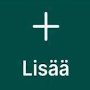

# **MARA-kuopan lisääminen**

1. Paina alavalikon -painiketta.
2. Tarkista, että valittuna tasona on ***MARA Kuoppa***.
3. Tarvittaessa siirrä sijaintiasi kartalla
4. Paina alhaalta 
5. Lisää kerros painamalla  -painiketta.
6. Täydennä kerroksen syvyys ja luokka. Tallenna kerros oikeasta yläkulmasta -painikkeesta.
7. Toista vaiheet 5 ja 6 jokaiselle kuopan kerrokselle.
8. Tallenna kuoppa kerroksineen yläkulmasta -painikkeesta.
9. Voit tarkastella kuoppaa ja sen luokitusta klikkaamalla sitä kartalla.

Avaa video

<iframe src="https://drive.google.com/file/d/1YvVkborpmX5lcEethbCEBcuu787CPSwS/preview" allowfullscreen></iframe>

