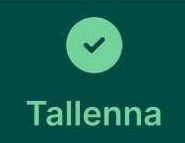

# **Muut ominaisuudet**

## **Kohteiden muokkaaminen ja poistaminen mobiilisovelluksessa**

Mergin Maps -mobiilisovelluksella voit kenttätyössä myös **muokata** ja **poistaa kohteita**.

### **Geometrian muokkaamminen**

-   Napauta haluamaasi kohdetta kartalta tai valikkolistasta ja napauta  ja sen jälkeen siirtääksesi pisteitä.

-  Tämän jälkeen kohteen solmupisteet korostuvat: niitä voi siirtää, poistaa tai muuttaa.

-   Lopuksi napauta  tallentaaksesi muutokset.

Avaa video

<iframe src="https://drive.google.com/file/d/1KTO25KkO2vyLWtmN7TnAOrZr43yxL-JE/preview" allowfullscreen></iframe>

### **Geometrian uudelleenpiirtäminen**

-   Napauta haluamaasi kohdetta kartalta tai valikkolistasta ja valitse   -painike muokataksesi ja  -painike.

-   Napauta ***Lisäasetukset*** eli 

-   ja valitse , tee uusi piirto ja 

Avaa video

<iframe src="https://drive.google.com/file/d/1MKbWQ7x2In4PGbVyNpPL6LcI1WTQxPSE/preview" allowfullscreen></iframe>

### **Geometrian muokkaaminen nauhoitustilan avulla**

1. Voit muokata kohdetta myös nauhoitustilan avulla eli liikkumalla kohteen ympäri

2. Napauta haluamaasi kohdetta kartalta ja valitse   ja  siirtääksesi pisteitä.

3. Napauta tämän jälkeen 

 ja valitse Nauhoitustila

-  Tämän jälkeen sijaintiasi nauhoitetaan ja napauttamalla taitepistettä se siirtyy sijaintiisi

### **Useiden kohteiden muokkaus**

-   Valitse ensin yksi kohde kartalta ja valitse sen jälkeen  -toiminto.

-   Valitse muut muokattavat kohteet ja avaa attribuuttilomake. Anna uudet arvot ja tallenna -- kaikkien valittujen kohteiden attribuutit päivittyvät kerralla.

Avaa video

<iframe src="https://drive.google.com/file/d/1cchAqXyZig3_XLkGfCvVYfgQcMjofkKX/preview" allowfullscreen></iframe>

### **Kohteiden poistaminen**

-   Valitse kohde kartalta tai listasta, avaa -lomake ja napauta  Vahvista poisto, niin kohde poistuu.

## **Viimeksi syötettyjen arvojen uudelleenkäyttö**

Voit nopeuttaa kenttätyössä samankaltaisten kohteiden syöttämistä ottamalla käyttöön viimeksi käyttämiäsi attribuuttiarvoja -- nämä kopioituvat automaattisesti seuraavaan kohteeseen.

### **Miten otat ominaisuuden käyttöön:**

3.  Avaa valikko napauttamalla  
 ja siirry kohtaan .

4.  Ota käyttöön valinta **"*Viimeksi syötetyn arvon uudelleenkäyttö*"**.

!!! note "**Miten se toimii käytännössä:**" 
    - Kun olet ottanut ominaisuuden käyttöön, siirry takaisin karttanäkymään. Siinä vaiheessa, kun lisäät uuden kohteen, attribuuttilomakkeessa näkyy valintaruudut jokaisen kentän vieressä.

    -   Valitse ne attribuutit (esim. laji tms.), joiden arvon haluat kopioida viimeksi tallennetusta kohteesta.

    -   Tallennettuasi kohteen, valitsemasi attribuuteille kopioituu edellinen arvo automaattisesti seuraavalla kohteella, kun taas muut kentät jäävät tyhjiksi.

## **Hakutoiminto**

Tasoilta voi hakea kohteita hakusanoilla otsikoista ja muistiinpanoista. Jos olet esimerkiksi merkannut lannoitusalueet 
tai kirjoittanut tehtyjä toimenpiteitä muistiinpanoihin, saat näistä helposti kaikki näkyviin. Avaa sovelluksen alareunasta **Tasot** ja valitse taso, jolta haluat tehdä haun. Kun saat tason auki, yläreunassa on hakukenttä. Voit hakea tietyn tyyppisiä kohteita tai etsiä hakusanalla kaikesta tasolle keräämästäsi aineistosta.

## **Pisteelle navigointi/merkintä kenttätyössä**

Mergin Maps -sovellus ohjaa sinua valitsemaasi pisteeseen näyttämällä sekä suuntaan että etäisyyteen pisteestä -- mikä auttaa tarkassa kenttätyöskentelyssä.

### **Kohteelle navigointi**

1.  Avaa karttanäkymä ja valitse haluamasi piste.

2.  Avaa ominaisuuslomake ja napauta  ja tämän jälkeen  

3.  Näet näkymän, jossa esitetään:

    -   Etäisyys nykyisestä sijainnistasi kohdepisteeseen.

    -   Viiva, joka yhdistää nykyisen sijaintisi ja pisteen.

    Tämä on pitkän matkan navigointitila

Kun olet alle 1 metrin päässä pisteestä, näkymä vaihtuu automaattisesti lyhyen matkan navigointitilaan.

Täsmällinen navigointi (alle 10 cm etäisyys) korostuu vihreällä, mikä auttaa tunnistamaan, että olet oikeassa kohdassa.

Avaa video

<iframe src="https://drive.google.com/file/d/1SuLu6QMYuvm63MYcvBJFzaA3UKYsxNk-/preview" allowfullscreen></iframe>

## **GPS-tarkkuus Mergin Maps -mobiilisovelluksessa**

Mergin Maps -sovellus näyttää reaaliaikaisen GPS-tarkkuuden, joka vaikuttaa suoraan kenttätyön paikkatietojen laatuun. Tarkkuus näkyy kartan alareunassa ja siihen liittyy värikoodattu ympyrä, joka havainnollistaa sijainnin arvioitua virhemarginaalia.

### **Mistä näet GPS-tarkkuuden?**

-   Tarkkuusnäyttö näkyy kartan vasemmassa alakulmassa.

  

-   **Väri** kertoo, onko tarkkuus asetetun raja-arvon sisällä (vihreä) vai ulkopuolella (oranssi).

- **Värikoodin raja-arvo** määritetään sovelluksen GPS-asetuksissa. 
(Oikea alakulman ***Lisää***)

-   **Napauta tarkkuusnäyttöä** saadaksesi lisätietoja, kuten:

    -   Horisontaalinen ja vertikaalinen tarkkuus (HDOP, VDOP)

    -   Käytettävissä olevien satelliittien määrä

    -   GPS-antennin korkeus (jos määritetty)

    -   Viimeisin sijaintitieto

    ### **Miten parannan GPS-tarkkuutta?**

-   **Odota vakaata signaalia**: Jos tarkkuus on heikko, odota hetki, että laite saa paremman signaalin.

-   **Käytä ulkoista GPS-laitetta**: Liitä laitteesi Bluetoothin kautta ulkoiseen GPS-vastaanottimeen saadaksesi tarkempia mittauksia.

-   **Varmista esteetön taivasnäkyvyys**: GPS-signaali heikkenee esteiden, kuten rakennusten tai tiheän puuston, takia.

!!! note "💡 Vinkki" 
    Jos haluat erittäin tarkan sijainnin, kannattaa käyttää [ulkoista               GPS-vastaanotinta](https://merginmaps.com/docs/field/external_gps/#list-of-known-supported-gps-devices), joka hyödyntää GPS-korjauksia.

## **Karttapiirrokset/luonnostelu**

!!! note "💡 HUOM!" 
    Vaatii että projekti on ladattu QGIS-työpöytäohjelmistoon. Jos et ole tehnyt tätä vielä, noudata ohjeiden kohtaa: [Projektin lataaminen tietokoneelle](https://gispocoding.github.io/eip-peltomappi/projektin_lataaminen.html#projektin-lataaminen-tietokoneelle-qgis-tyopoytasovellukseen)

Mergin Mapsin karttapiirros (Map Sketching) -ominaisuuden avulla käyttäjä voi piirtää vapaalla kädellä kartan päälle mobiilisovelluksessa. Piirroksia voi tehdä eri väreillä ja ne tallentuvat erilliseen kerrokseen, joka synkronoituu takaisin QGIS-projektiin. Ominaisuus sopii esimerkiksi kenttämuistiinpanojen, reittien tai huomioiden merkitsemiseen nopeasti ilman, että tarvitsee luoda varsinaisia kohteita tietokantaan.

### **Työkalun käyttöönotto**

1.  Avaa projekti QGIS-ohjelmassa.

2.  Valitse ylävalikosta ***Projekti → Ominaisuudet.***

3.  Siirry ***Mergin Maps*** -välilehdelle.

4.  Ota käyttöön ***Enable map sketching*** -valintaruutu. Halutessasi voit myös määrittää värit, joita mobiilisovelluksessa voi käyttää piirroksissa.

5.  Tallenna muutokset. Projektiin luodaan uusi GeoPackage-tiedosto nimeltä ***map_sketches.gpkg***, joka sisältää piirroskerroksen.

6.  Synkronoi projekti Mergin Maps -palveluun.

### **Karttapiirrosominaisuuden käyttäminen**

1.  Napsauta karttapiirroskuvaketta ***(kynä)*** vasemmassa alakulmassa.

2.  Avautuu piirrosvalikko. Piirrä vapaalla kädellä tai styluksella.

3.  Valitse yksi seitsemästä (oletusväriset) tai projektissa määritellyistä väreistä.

4.  Käytä kumityökalua virheiden korjaamiseen ja ***Kumoa***-painiketta viimeisen muutoksen perumiseen.

5.  Sulje piirrosnäkymä esimerkiksi vihreällä ***X***-painikkeella.

Avaa video

<iframe src="https://drive.google.com/file/d/1TnyIE0WfYiK_RKHdSKGWvaUlRTl3Wkik/preview" allowfullscreen></iframe>

## **Pituuden ja pinta-alan mittaaminen mobiilisovelluksessa**

### **Viivan pituuden mittaus**

1.  Napauta näytön alareunassa olevaa .

2.  Valitse avautuvasta valikosta -vaihtoehto.

3.  Napauta  lisätäksesi pisteitä mittaamasi viivan varrelle.

4.  Lisättyjen pisteiden välinen pituus näkyy mittaustyökalun paneelissa.

5.  Nykyinen pituus näkyy ristihiiren osoittimen lähellä, kun siirrät sitä.

6.  Jos haluat poistaa viimeisen lisätyn pisteen, napauta 

7.  Kun olet valmis mittauksen kanssa, napauta 

Avaa video

<iframe src="https://drive.google.com/file/d/1_I1kABk25cw7wkmXJ3ydEjtYYLBrn9es/preview" allowfullscreen></iframe>

### **Pinta-alan mittaus**

1.  Napauta   lisätäksesi pisteitä haluamasi alueen kulmiin.

2.  Kun siirrät ristihiiren osoittimen ensimmäisen pisteen lähelle, näet  -vaihtoehdon.

3.  Napauta sulkeaksesi alueen ja saadaksesi pinta-alan mittauksen.

4.  Pinta-alan ja ympärysmitan arvot näkyvät mittaustyökalun paneelissa.

5.  Napauta  aloittaaksesi uuden mittauksen.

Avaa video

<iframe src="https://drive.google.com/file/d/1qDeutE9MvH_qxlQbpHT-SsOn4Ma3vjit/preview" allowfullscreen></iframe>

!!! warning "💡 HUOM!" 
    Mitatut arvot eivät tallennu

## **Mergin Mapsin synkronointi mobiilisovelluksessa**

Mergin Maps-sovelluksella voit varmistaa, että tekemäsi kenttätyön muutokset synkronoituvat projektisi pilveen -- joko **manuaalisesti** tai **automaattisesti**.

### **Perusedellytykset synkronointiin**

-   Sinun täytyy olla kirjautunut Mergin Maps-tilillesi.

-   Laite tarvitsee verkkoyhteyden synkronointia varten.

-   Sinulla tulee olla projektiin kirjoitusoikeudet.

### **1. Manuaalinen synkronointi**

-   Napauta karttanäkymässä olevaa 

-   Kun synkronointi on valmis, painike lakkaa pyörimästä ja näytölle ilmestyy ilmoitus: 

-   Voit halutessasi tarkastella odottavia muutoksia napauttamalla  →   

### **2. Automaattinen synkronointi**

-   Siirry sovelluksen **Asetuksiin** ja ota käyttöön valinta **Synkronoi muutokset automaattisesti**

  

-   Tämän jälkeen Mergin Maps synkronoi tekemäsi muutokset (kuten kohteiden lisäykset tai muokkaukset) automaattisesti, kun muutoksia tapahtuu ja internet-yhteys on saatavilla.

-   Synkronoinnin eteneminen näkyy Synkronoi-painikkeen animaation kautta, ja onnistuneen synkronoinnin jälkeen ilmestyy ilmoitus  
-   Jos internet-yhteys katkeaa synkronoinnin aikana, pysähtyy automaattinen synkronointi ja vaatii uuden yrityksen, kun yhteys palautuu.

