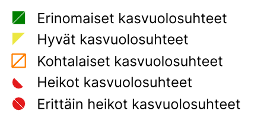

# **Penetrometri**

1.  Paina alavalikon  painikkeesta.

2.  Tarkista, että valittuna tasona on ***Penetrometri***.

3.  Siirry kartalla haluamaasi sijaintiin.

4.  Napauta alhaalta 

5.  Syötä tarvittavat ominaisuustiedot.

6.  Valitse lopuksi oikean yläkulman 

Avaa video

<iframe src="https://drive.google.com/file/d/1Zd3uz1QsACq4c7LoOVfdNT7PGA2acDqv/preview" allowfullscreen></iframe>

Tällä hetkellä voit tallentaa seuraavat ominaisuustiedot:

-   Maan tiiveys:

-   Syvyys alkuarvo

-   Syvyys loppuarvo

-   Päivämäärä ja aika

-   Muistiinpanot

Anna palautetta ominaisuudesta alla olevan lomakkeen avulla:

[Palautelomake penetrometri](https://docs.google.com/forms/d/e/1FAIpQLSfsGGxcdoyVvwqIh-dGyleqlHLDa48dSnIgMMCHhSZR-pgl4Q/viewform?usp=pp_url&entry.76641795=Penetrometri)

