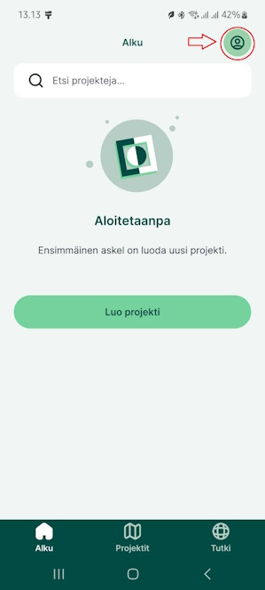
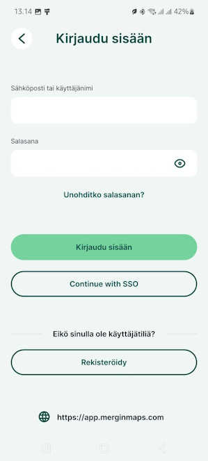
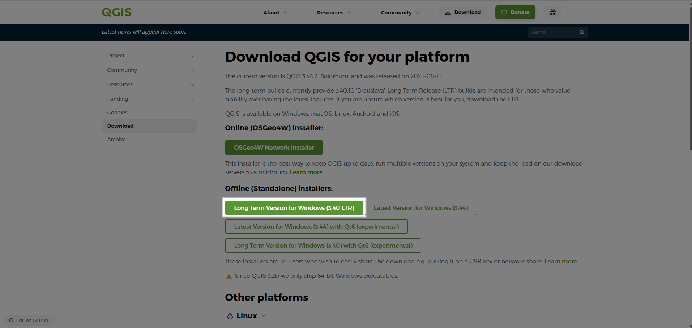

# Projektin lataaminen

## Projektin lataaminen mobiilisovellukseen

Kun olet ladannut puhelimeesi Mergin Maps sovelluksen.

Tee tunnukset palveluun osoitteessa: <https://app.merginmaps.com/register>

Tämän jälkeen avaa sovellus.

Klikkaa oikean yläkulman ikonia:

Kirjaudu tämän jälkeen tunnuksillasi sisään:

Klikkaa tämän jälkeen alareunan ***Projektit***- kohtaa ja lataa eip-peltomappi- projekti

<iframe src="https://drive.google.com/file/d/15Y8Q-OHDhgEhV4rY7L_RVG6gBxOKRb9g/preview" width="50%" height="900" allowfullscreen="allowfullscreen">

</iframe>

## Projektin lataaminen tietokoneelle QGIS-työpöytäsovellukseen

### QGIS:n lataaminen ja asentaminen

Mene QGIS:n viralliselle sivulle: <https://qgis.org/>

Valitse ***Download Now*** ja lataa versio:

{width="261"}

käyttöjärjestelmällesi (Windows, Mac, Linux).

Asenna QGIS seuraamalla asennusohjeita.

### MerginMaps-lisäosan asentaminen QGIS:iin

1.  Avaa QGIS

2.  Valitse ylävalikosta ***Lisäosat → Hallinnoi ja asenna lisäosia*****.**

3.  Kirjoita hakukenttään ***Mergin*****.**

4.  Valitse ***Mergin Maps*** ja klikkaa ***Asenna lisäosa*****.**

Kun asennus on valmis, lisäosa löytyy QGIS:n selain ikkunasta, jonka otsikko on *Mergin Maps*.

**Kirjautuminen MerginMaps-lisäosaan**

Avaa lisäosa valikosta: ***Lisäosat → Mergin Maps → Configure MerginMaps plugin*** -ikonista.

Tämän jälkeen ohjelma pyytää asettamaan uuden päätodennussalasanan. Anna siihen haluamasi salasana

Kirjaudu sisään Mergin-tililläsi.

Kun kirjaudut, lisäosa yhdistyy Mergin-tiliisi, ja voit nähdä projektisi listattuna.

**Projektin lataaminen QGIS:iin MerginMaps-lisäosalla**

1.  Avaa ***Mergin Maps*** -paneeli QGIS:ssä vasemman laidan selainosiosta.

2.  Paneelissa näet kaikki projektisi.

3.  Valitse projekti, jonka haluat ladata.

4.  Klikkaa ***Download*** ***projec****t* (Lataa projekti).

5.  Valitse kansio, johon projekti tallennetaan. Laita mieleen tämä sijainti. Tähän samaan sijaintiin tallennetaan myöhemmin [georeferoidut kuvat](https://gispocoding.github.io/eip-peltomappi/salaojakarttojen_georeferointi.html).

6.  QGIS avaa projektin ja siihen liittyvät aineistot automaattisesti.

