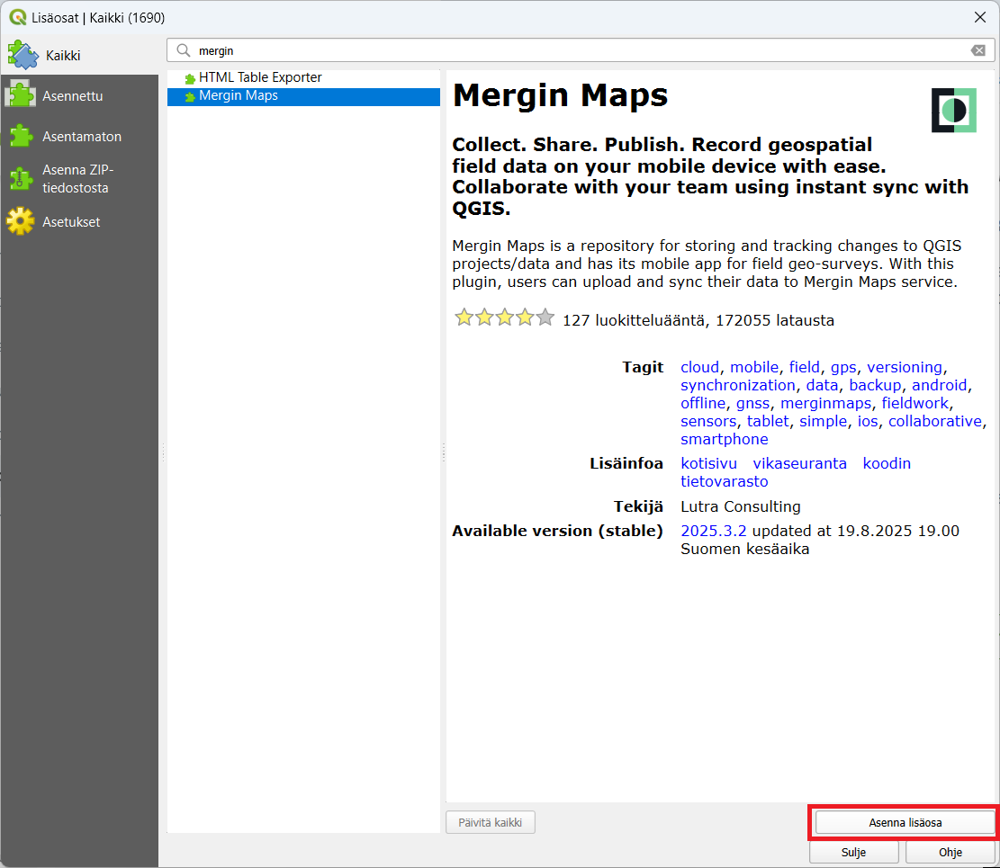
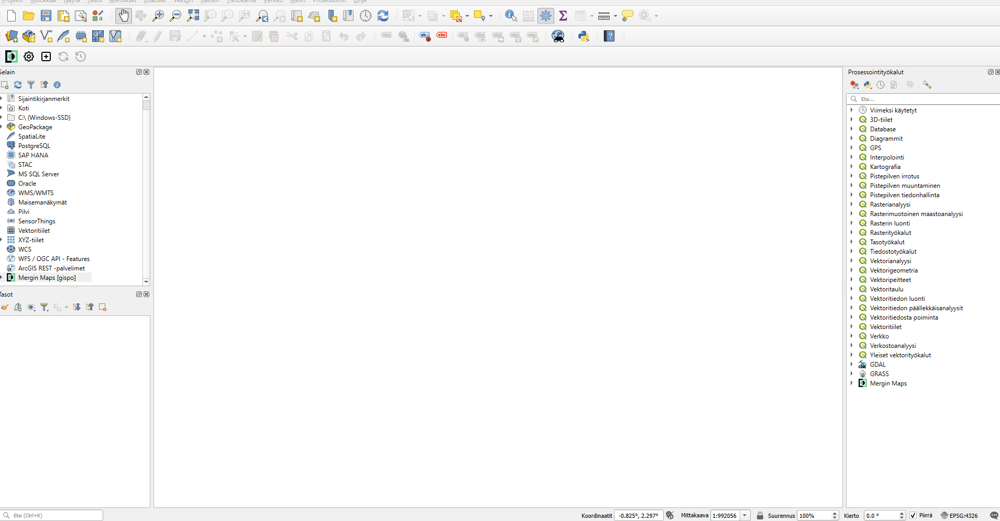

## QGIS:n lataaminen ja asentaminen

Mene QGIS:n viralliselle sivulle: <https://qgis.org/>

Valitse Download Now ja lataa versio:

{width="261"}

käyttöjärjestelmällesi (Windows, Mac, Linux).

Asenna QGIS seuraamalla asennusohjeita.

## MerginMaps-lisäosan asentaminen QGIS:iin

Avaa QGIS

Valitse ylävalikosta Lisäosat → Manage and Install Plugins... (Lisäosat → Hallinnoi ja asenna lisäosia).

Kirjoita hakukenttään Mergin.

Valitse Mergin Maps ja klikkaa Asenna lisäosa.

Kun asennus on valmis, lisäosa löytyy QGIS:n selain ikkunasta, jonka otsikko on Mergin Maps.

**Kirjautuminen MerginMaps-lisäosaan**

Avaa lisäosa valikosta: Plugins → Mergin Maps → Configure MerginMaps plugin -ikonista.

Tämän jälkeen ohjelma pyytää asettamaan uuden päätodennussalasanan. Anna siihen haluamasi salasana

Kirjaudu sisään Mergin-tililläsi.

Kun kirjaudut, lisäosa yhdistyy Mergin-tiliisi, ja voit nähdä projektisi listattuna.

**Projektin lataaminen QGIS:iin MerginMaps-lisäosalla**

1.  Avaa Mergin Maps -paneeli QGIS:ssä vasemman laidan selainosiosta.

2.  Paneelissa näet kaikki projektisi.

3.  Valitse projekti, jonka haluat ladata.

4.  Klikkaa Download project (Lataa projekti).

5.  Valitse kansio, johon projekti tallennetaan.

6.  QGIS avaa projektin ja siihen liittyvät aineistot (layerit) automaattisesti.

