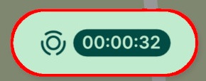

# **Reitin nauhoitus**

Reitin nauhoituksen avulla voit tallentaa esimerkiksi ajoreittisi. Tallennuksen aikana voit lisätä muita kohteita tai käyttää myös muita sovelluksia. Nauhoitus pyörii siis taustalla niin kauan kunnes sen sammuttaa.

**Käynnistä seuranta:**

1.  Napauta ***Lisää*** -painiketta.

2.  Valitse ***Sijainnin nauhoitus***

3.  Napauta ***Aloita sijainnin nauhoitus***.

4.  Sovellus alkaa tallentaa sijaintiasi taustalla.

**Pysäytä seuranta:**

1.  Napauta karttanäytöltä aikaindikaattoria

    

2.  Napauta ***lopeta nauhoitus***

3.  Tallennetut reitit löytyvät ***tracking_layer***-tasosta projektissasi.

Huomioitavaa

-   Tallennus: Paikannusseurannan tiedot tallennetaan automaattisesti projektiin.

-   Synkronointi: Muista synkronoida projekti säännöllisesti varmistaaksesi, että tiedot tallentuvat pilveen.

Avaa video

<iframe src="https://drive.google.com/file/d/1iAFJwCUwlcTLW9dgt3xghvVP_HD7z_m6/preview" allowfullscreen></iframe>

