## **Aineistojen valmistelu: Georeferoija lisäosan aktivointi**

!!! example "💡 HUOM!"
    Vaatii että projekti on ladattu QGIS-työpöytäohjelmistoon. Jos et ole tehnyt tätä vielä, noudata ohjeiden kohtaa: [Projektin lataaminen tietokoneelle](https://gispocoding.github.io/eip-peltomappi/projektin_lataaminen.html#projektin-lataaminen-tietokoneelle-qgis-tyopoytasovellukseen)

Georefereroija-lisäosa voi vaatia aktivoinnin. Uusimmissa
QGIS-versioissa (alkaen versiosta 3.28.) lisäosa pitäisi olla
aktivoituna valmiiksi, mutta jos käytät vanhempaa versiota (3.22), niin
QGIS vaatii sisäänrakennetun Georeferencer-lisäosan aktivoinnin
georeferointia varten. Lisäosa aktivoidaan **Lisäosat-valikon** takaa
löytyvän **Hallitse ja asenna lisäosia/Manage and Install Plugins**
-toiminnon avulla. Tässä ohjeistuksessa oletetaan, että lisäosa on
aktivoitu onnistuneesti.

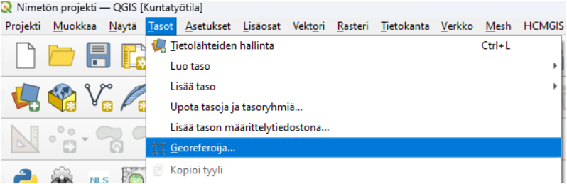

*Kuva 1. Uudemmissa QGIS-versioissa Georeferoija löytyy tasot-valikosta*

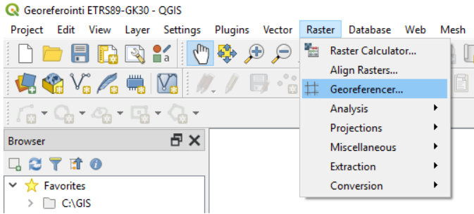

*Kuva 2. Vanhemmissa versioissa se löytyy Rasterit-valikosta.*

## **Georeferoija-lisäosan toiminta**

Huomaa, että jos sinulla on PDF-tiedosto, jonka haluat georeferoida, se
tulee muuttaa ensin kuvaformaattiin (esim. .JPEG tai .PNG). Tämä
onnistuu useimmilla PDF-lukuohjelmilla tai netissä saatavilla olevilla
muuntimilla (Googleen "PDF to PNG converter").

Kun avaat Georeferencer-lisäosan, se avaa erillisen ikkunan, jossa
georeferointi toteutetaan. Georeferencer-ikkunaan voidaan avata
georeferoitava rasterikuva **Avaa rasteri**... -painikkeesta (kuva 3).
Painikkeesta avautuu ikkuna, jonka avulla georeferoitavan kuvan voi
valita koneen tiedostojärjestelmästä. Tuettuina on useita kymmeniä eri
rasteriformaatteja aina perinteisistä JPEG- ja PNG-formaateista
tehokkaisiin JPEG2000- ja ECW-formaatteihin.

*Kuva 3. Georeferoitava rasteri avataan Georeferencer-ikkunaan Avaa
rasteri -painikkeesta*

Valitse rasteriksi aikaisemmin kuvatiedostoksi muunnettu salaojakartta..
Kun haluttu kuva on valittu tiedostojärjestelmästä ja valinta
vahvistettu Open-painikkeesta, avautuu käyttäjälle valittu rasteri
näkyviin pienen latauksen jälkeen.

Vanhemmissa versioissa tässä kohtaa avautuu käyttäjälle Coordinate
Reference System Selector -ikkuna. Tähän ikkunaan syötetään tieto siitä
koordinaattijärjestelmästä, johon georeferoitava rasterikuva halutaan
saattaa. Tässä esimerkissä käytettäväksi koordinaattijärjestelmäksi
valitaan **ETRS89-TM35FIN (EPSG:3067)**, mutta yhtä hyvin
koordinaattijärjestelmäksi voidaan valita mikä tahansa QGISin tukema
koordinaattijärjestelmä.

Tämän vaiheen jälkeen määritellään georeferoinnissa käytettävät
asetukset. Tämä tapahtuu avaamalla **Asetukset**-valikosta **Muunnoksen
asetukset** -ikkuna (kuva 4). Saman ikkunan saa avattua myös
työkaluriviltä keltaisesta ratassymbolista.

*Kuva 4. Georeferoinnin asetukset määritellään Asetukset-valikosta
löytyvän Muunnoksen asetukset -painikkeen takaa*

**Muunnoksen asetukset** -ikkunassa määritellään muunnoksessa
käytettävät asetukset (kuva 5). Toteutettavan muunnoksen osalta (Kohta
**Muunnosparametrit**) valittavissa on muunnoksen tyyppi,
interpoloinnissa käytettävä menetelmä ja koordinaattijärjestelmä.
Muunnoksessa syntyvän tiedoston osalta ikkunassa voidaan määritellä
syntyvän tiedoston nimi, tallennussijainti sekä pakkausmenetelmä.

Tarkista, että muunnoksen tyyppi on **Helmert**, menetelmä **Nearest
Neighbour** ja aseta koordinaattijärjestelmäksi **EPSG:3067**.

Valitse tulostiedosto kohtaan MerginMapsin-projekti kansio ja sen
sisältä kansio `_rasters` näin saat helpoiten synkronoitua
rasteritiedoston suoraan mobiilisovellukseen.

Muunnoksesta on mahdollista saada ulos myös kartta ja raportti
(Raportit-kohta). Näiden tallennuspaikat määritellään tarvittaessa.
Varmista myös, että ikkunan alareunasta löytyvä "Avaa tulosrasteri
QGISissä kun valmis" -täppä on aktiivisena. Näin saat suoraan valmiin
georeferoidun rasterin auki QGISin karttaikkunaan georeferoinnin
jälkeen.

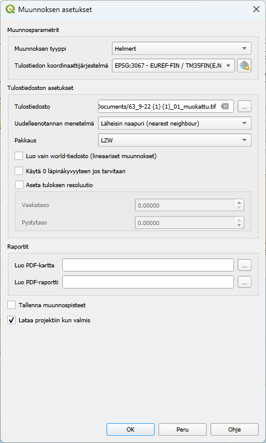

*Kuva 5. Muunnoksen asetukset -ikkuna halutuilla asetuksilla
(Transformation Settings)*

Kun muunnoksen asetukset on onnistuneesti määritelty, paina
asetusikkunasta "OK".

## **Panosta vastinpisteisiin**

Tässä vaiheessa kannattaa laittaa tarttuminen kohteisiin päälle, jotta
vastinpisteiden kohdistaminen on helpompaa. Siirry ylävälilehdeltä --\>
Projekti --\> Tarttumisen valinnat

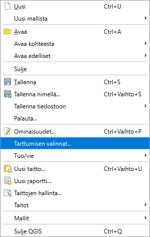

Klikkaa tämän jälkeen avautuvasta ikkunasta magneetti-ikonia niin
tarttuminen on päällä kaikille tasoille.

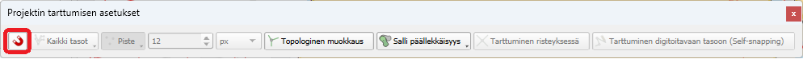

Tämän jälkeen voit sulkea ikkunan ruksista.

Nyt voidaan siirtyä määrittelemään vastinpisteitä. Homma lähtee
liikkeelle valitsemalla työkaluriviltä löytyvä Add Point -työkalu (kuva
6). Ko. painikkeen vierestä oikealta löytyvät tarvittaessa painikkeet jo
määriteltyjen vastinpisteiden poistamiseen ja muokkaamiseen. Lisää piste
-painikkeen painaminen aktivoi työkalun, jolla osoitetaan
georeferoitavalta kuvalta piste.

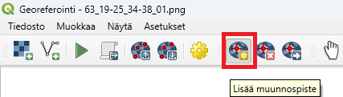

*Kuva 6: Georeferointi aloitetaan lisäämällä rasterukuvalle
oikaisupisteitä*

Kun Lisää piste -työkalulla on osoitettu piste georeferoitavalta
kuvalta, avautuu Kirjoita karttakoordinaatit (Enter Map Coordinates)
-ikkuna (kuva 7). Ikkunaan voi halutessaan syöttää koordinaattitiedot
käsin, mutta huomattavasti kätevämpi tapa on poimia ne
QGIS-paikkatietosovelluksen pääikkunasta painamalla
"Karttaikkunasta"-painiketta.

Usean näyttöruudun käsittävä setup helpottaa merkittävästi
vastinpisteiden napsuttelua. Mikäli tällaista järjestelyä ei ole
käytettävissä (esim. operoitaessa pienellä kannettavan ruudulla),
voidaan elämää helpottaa täppäämällä "Piilota goereferoinnin ikkuna
automaattisesti" -kohta. Tällöin Georeferencer sukeltaa automaattisesti
piiloon Karttaikkunasta -painiketta painettaessa.

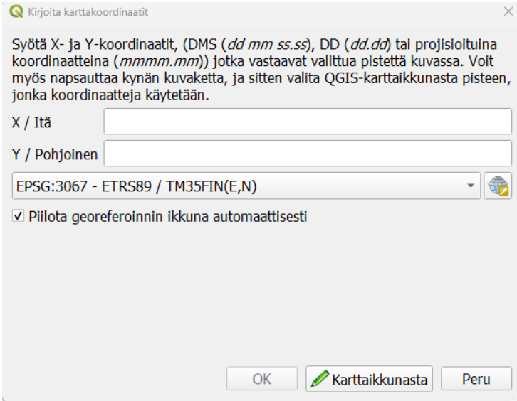

*Kuva 7: Oikaisupisteen tiedot annetaan Kirjoita
karttakoordinaatit-ikkunassa*

Kun pisteelle on koordinaatit (joko QGIS-pääikkunasta osoittaen tai
käsin syöttämällä), nähdään kentissä X / Itä ja Y / Pohjoinen
numeroarvoja (kuva 8). Tässä esimerkissä käytetään
ETRS89-TM35FIN-koordinaattijärjestelmää (EPSG:3067), jonka koordinaatit
ovat kuvassa. Vaihtoehtoisesti voit valita alasvetovalikosta toisen
käytettävän koordinaattijärjestelmän (valittava siis samaksi kuin
pääkanvaasi näkymässä)

Onnistunut ja laadukas georeferointi vaatii useiden vastinpisteiden
määrittelyn. Kuten aiemmin todettiin, vastinpisteiksi kannattaa valita
esimerkiksi rakennusten kulmia, kiinteistörajoja ja muita helposti ja
yksiselitteisesti tukiaineistosta tulkittavia kohteita. Vastinpisteet
kannattaa lisäksi pyrkiä osoittamaan huolellisesti ja tarkasti sekä eri
puolille georeferoitavaa kuvaa.

Tarkkuus korostuu etenkin silloin, kun vastinpisteitä osoitetaan
ainoastaan muutamia. Mitä enemmän vastinpisteitä voidaan osoittaa, sen
pienempi on yksittäisestä pisteestä aiheutuva vaikutus muunnokseen.

Kun vastinpisteen tiedot ovat Kirjoita karttakoordinaatit -ikkunassa ja
oikea koordinaattijärjestelmä valittu, voidaan vastinpiste tallentaa
painamalla OK-painiketta. Tällöin vastinpiste tallentuu ns.
vastinpistetauluun (GCP-taulu) ja ikkuna sulkeutuu. Uuden pisteet saa
lisättyä Lisää piste -painikkeesta.

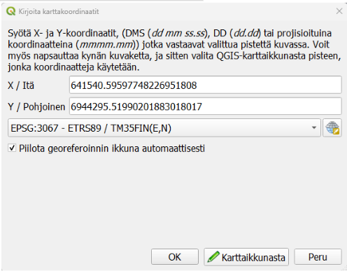

*Kuva 8: Oikaisupisteen tiedot syötetty*

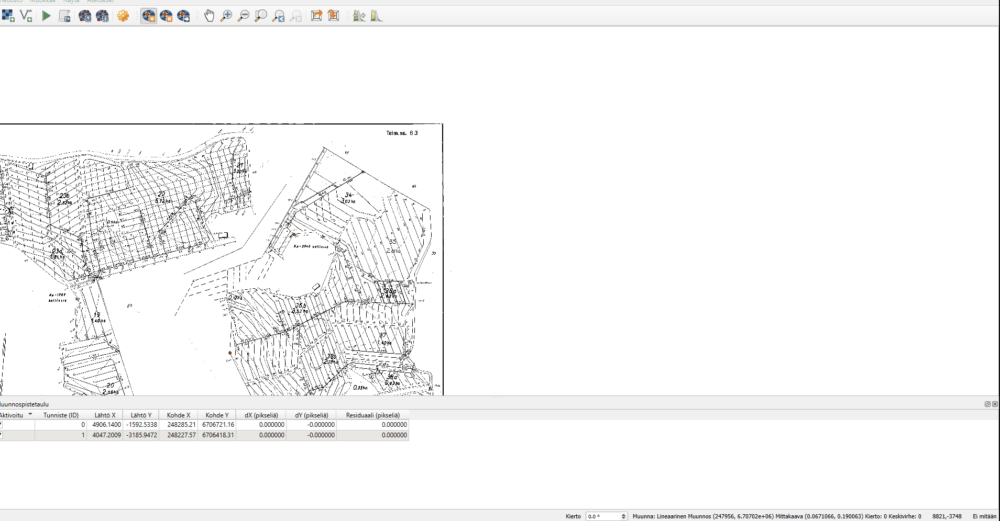

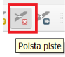

*Kuva 9: Jos haluat poistaa jonkun vastinpisteen, voit sen tehdä Poista
piste -työkalulla. Aktivoi työkalu ja klikkaa sillä
georeferointi-ikkunassa näkyvää pientä punaista pistettä (vastinpiste).*

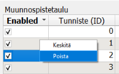

*Kuva 10: Poistaminen voidaan tehdä myös muunnospistetaulussa
klikkaamalla haluttua riviä hiiren oikealla ja valitsemalla "Poista".*

## **Vastinpisteiden tarkastelu ja varsinainen georeferointi**

Kun tarvittava määrä vastinpisteitä on syötetty, voidaan niitä
tarkastella vastinpistetaulun (GCP-taulu) avulla. Mikäli
vastinpistetaulu ei näy automaattisesti Georeferencer-ikkunassa ns.
paneelina, voidaan se avata Näytä-valikosta löytyvän Paneelit-valikon
alta (kuva 11).

*Kuva 11: Syötettyjä oikaisupisteitä ja niiden vastinpisteitä voi
tarkastella CGP-taulusta*

Vastinpistetaulussa on nähtävillä kaikki osoitetut vastinpisteet (kuva
10). Tässä esimerkissä on määritelty kymmenen vastinpistettä. Jokaisella
vastinpisteelle esitetään taulussa sijainti georeferoitavalla kuvalla
(Lähtö X ja Lähtö Y) ja sijainti tukiaineistossa (Kohde. X ja Kohde. Y).

Näiden tietojen lisäksi jokaiselle pisteelle lasketaan virhe X- ja
Y-suunnassa. X- ja Y-suuntaisten virhelukujen lisäksi jokaiselle
pisteelle on laskettu residuaali, joka kuvaa ko. pisteen
kokonaisvirhettä. Ideaalitilanteessa residuaaliarvo olisi mahdollisimman
lähellä nollaa.

Huomaa, että virhearvot esitetään pikseleinä. Mikäli jokin vastinpiste
eroaa virhearvojen (Residuals/Residuaalit) osalta muista, kannattaa se
poistaa ja määritellä uudelleen. Tässä esimerkissä olevat pisteet
näyttäisivät olevan hyvin linjassa toistensa kanssa eikä selkeitä
poikkeamia esiinny. Voidaan siis edetä hyvillä mielin viimeiseen
vaiheeseen, jossa itse georeferointi toteutetaan.

*Kuva 12: GCP-taulussa nähdään kaikki syötetyt vastinpisteet.*

Kun tarvittava määrä vastinpisteitä on määritelty ja ne on todettu
hyviksi vastinpistetaulua tarkastelemalla, voidaan käynnistää
varsinainen georeferointi. Tämä tapahtuu Georeferencer-ikkunan **Start
Georeferencing** -painikkeesta (kuva 13).

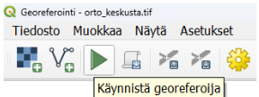

*Kuva 13: Georeferointi käynnistetään Start
Georeferencing-painikkeesta.*

Mikäli Muunnoksen asetukset (Transformation Settings) -ikkunassa on
laitettu täppä kohtaan "Load in QGIS when done", avautuu georeferoitu
kuva automaattisesti QGISiin georeferoinnin jälkeen. Mikäli täppää ei
ole laitettu, voi kuvan lisätä myös manuaalisesti Open Data Source
Manager -toiminnon kautta.

## **Vaihda valkoinen väri läpinäkyväksi**

Avaa juuri luodun georeferoidun tason ominaisuudet klikkaamalla tasoa
hiiren oikealla --\> Ominaisuudet --\> Läpinäkyvyys

Aseta valkoinen väri (RGB 255,255,255) läpinäkyväksi ja klikkaa lopuksi
"OK"

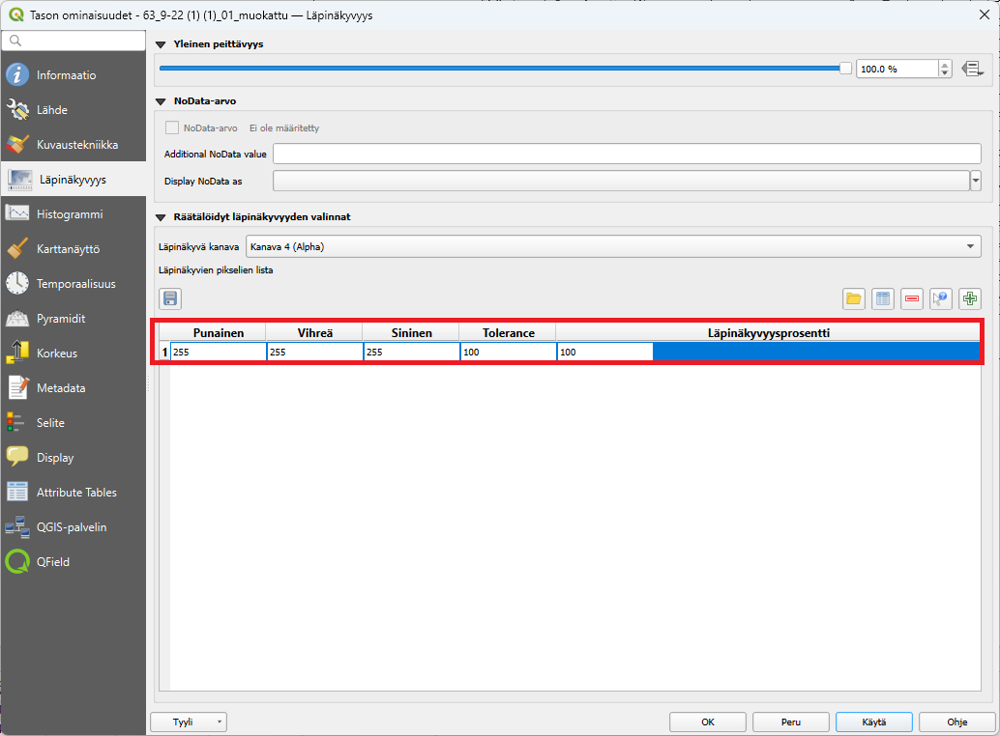

## **Lataa QGIS-lisäosa MapSwipe Tool**

Kätevä työkalu kahden tason vertaamiseen on QGISin lisäosa MapSwipe
Tool. Tällä lisäosalla voit verrata kahden tason näkymää olipa tason
formaatti mikä tahansa.

Asentamisen jälkeen ylätyökalu-palkkiin pitäisi ilmestyä seuraava ikoni
.

Klikkaa ikonia ja sen jälkeen voit joko vaakatasossa tai pystytasossa
"swaippailla". Suunta määräytyy sen mukaan mikä on hiiren suunta.

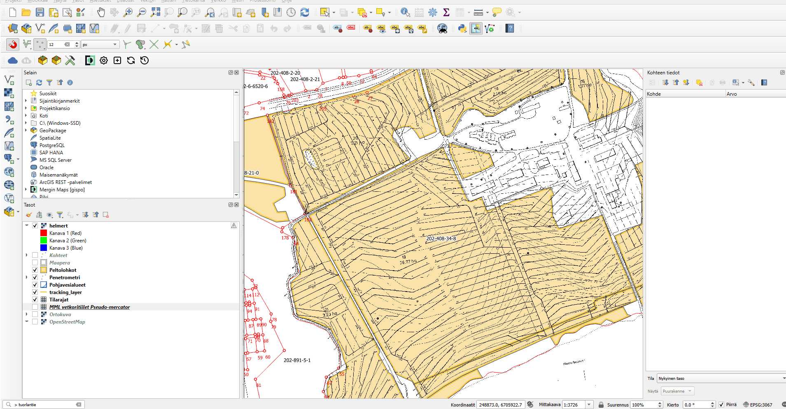Kun olet tyytyväinen
lopputulokseen niin synkronoi nämä muutokset projektiisi painamalla
MerginMaps-lisäosan "Synchronize Mergin Maps project"

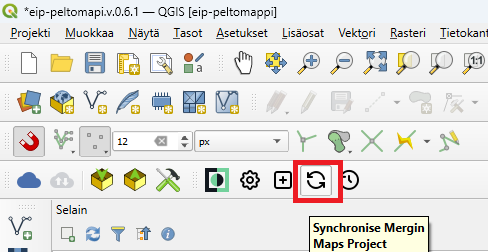

Tämän jälkeen salaojarkartta näkyy MerginMaps-mobiilisovelluksessa:

<iframe src="https://drive.google.com/file/d/1UHyWmI-Mw776rHhh-eEaKhVrLwPajZBe/preview" width="50%" height="900" allowfullscreen="allowfullscreen">

</iframe>
