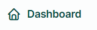
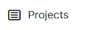
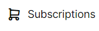
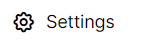
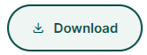

# **Selain hallintapaneeli**

Projektiasi voi tarkastella myös selaimen kautta. Selaimen avulla et voi kuitenkaan lisätä tai editoida kohteita. Se on tarkoitettu ainoastaan aineiston katseluun tällä hetkellä.

Pääset tarkastelemaan projektiasi kun kirjoitat selaimen URL-osoitteeksi [app.merginmaps.com](app.merginmaps.com) ja kirjaudut omilla tunnuksillasi sisään. 

## **Ohjevideo**

Avaa video

<iframe src="https://drive.google.com/file/d/1lWPMERqoIfKSijdr0rO1TSdlV6GL3FuY/preview" allowfullscreen></iframe>

## Projekteihin liittyvät toiminnot

### **1.** 

Kun kirjaudut hallintapaneeliin, saat nopean yleiskatsaukse aktiivisista projekteista nykyisessä työtilassasi. Täällä voit myös hallita projektejasi, työtilojasi, profiiliasi ja tilauksiasi.

### **2.** 

Vasemmasta paneelista **Projects-välilehti** näyttää listan projekteista, joihin sinulla on pääsy tässä ympäristössä.

Täällä voit:

* hakea projektia nimen mukaan
* klikata projektia nähdäksesi sen tiedot

Kun avaat tietyn projektin, näet projektin sisällön yleiskatsauksena. 

Yläkulmasta löydät painikkeet projektin tiedostojen lataamiseen koneellesi.

### **3.** 

Jäsenet-välilehti tarjoaa yleiskatsauksen työtilan jäsenistä

### **4.** 

Tilaukset-välilehti sisältää tietoja tilaussopimuksestasi. Tämä välilehti on käytettävissä vain työtilan omistajille.

### **5.** 

Asetukset-välilehdeltä löydät tietoja nykyisestä työtilasta.

### **6. Files (tiedostot)** 

Tiedostot-välilehdellä näet kaikki projektin tiedostot. Voit klikata tiedostoa nähdäksesi, milloin se on muokattu, sen koon, sekä voit ladata tiedoston tai poistaa sen.

### **7. Map (Kartta)**

Map-välilehdellä näytetään projekti suoraan hallintapaneelissa ilman, että tarvitsee avata QGISia tai mobiilisovellusta. 

Webkartoissa näet karttatasot (survey layers) tai rasteritasot, jotka sisältyvät projektiisi.

Muita tasoja, kuten taustakartat verkossa ei näytetä.

Kaikki dashboardin kartat käyttävät taustakarttana Mergin Mapsin vektoritiilipalvelua.

Karttojen sisältö ja Layers-paneeli päivittyvät aina, kun projekti synkronoidaan. Näin näet aina ajantasaiset paikkatiedot.

Kerrospaneelissa listataan kaikki kartalla näkyvät kerrokset. Näyttöruudussa olevat silmäkuvakkeet (✅) säätelevät kerrosten näkyvyyttä.

### **8. Historia (History)**

History-välilehti sisältää yleiskatsauksen projektin versioista. Vaihtoehtoisesti voit ladata vanhempia versioita koneellesi.

Voit klikata tiettyä versiota nähdäksesi sen tarkemmat tiedot.

### **9. Collaborators (Työtilakumppanit)**

Collaborators-välilehdellä näet käyttäjät, joilla on pääsy projektiin, sekä mahdolliset lähetetyt kutsut. 

### **10. Asetukset (Settings)**

Asetukset-välilehdellä on mahdollista (ei suositella):

* tehdä projektista julkisen tai yksityisen
* siirtää projektin toiseen workspaceen
* poistaa projektin

### **11. Profiili ja workspace-asetukset**

* Profiiliin pääset klikkaamalla käyttäjänimeä oikeassa yläkulmassa.
  Täällä voit muokata omia tietojasi kuten nimeä ja sähköpostia, vaihtaa salasanaa, hallinnoida ilmoituksia workspaceen liittyen sekä sulkea tilin.

* Workspace-asetukset löytyvät samasta paikasta: *Manage workspaces*. Näet workspace-listan, jossa olet jäsenenä tai omistajana. Voit muodostaa uusia workspaceja, lähteä workspaceista tai hyväksyä/torjua kutsuja.

 -painikkeella voit ladata koko projektitiedostosi tietokoneellesi.

