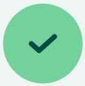

# **Tietojen lisääminen Peltolohokolle**

Saat listan kaikista peltolohkolle lisätyistä alueista sekä pistemäisistä kohteista. 
Napauta sovelluksessa haluamaasi peltolohkoa, avautuvassa ikkunassa lukee viisi viimeistä tallennettua tapahtumaa. Lomake poimii kaikki peltolohkon alueelle ja 10 metrin sätelle tallennetut alueet sekä pistemäiset kohteet.

Napauttamalla **ikkunaa** saat näkyviin kaikki lohkolle tallennetut kohteet eriteltynä.  

Lomakkeelta lisätään uusia kohteita  -merkkiä painamalla. Tämän jälkeen pääset valitsemaan kohteellesi sijainnin ja täyttämään lomaketta. Seuraavissa kappaleissa tarkemmin ohjeet eri kohteiden tallentamiseen.

## **Kohteen lisääminen** 
**(Kasvustokohteet, Kiinteätpisteet, Toimenpidepisteet)**

1.  Napauta kartalta peltolohkoa, jolle haluat lisätä kohteen

2.  Valitse oikean kategorian ja tason mukainen kohde, jolle haluat lisätä

3.  Napauta + ikonia 

4.  Siirry kartalla haluamaasi sijaintiin.

5.  Napauta alhaalta 

6.  Syötä tarvittavat ominaisuustiedot.

7.  Valitse lopuksi oikean yläkulman 

Avaa video

<iframe src="https://drive.google.com/file/d/1kPA5kSyEu1p16B7XwNVBxHOx28aaijkx/preview" allowfullscreen></iframe>

Uuden kohteen lisääminen sijoittuu automaattisesti omaan sijaintiisi. Tämän voi muuttaa asetuksista, napauta oikeasta alakulmasta  **→**  **→** ***Lukitse automaattisesti sijainti***. Kun asetus on pois päältä (eli ), uusi kohde sijoittuu aina karttanäyttösi keskikohtaan.

## **Alueen lisääminen**
**(Maaperäalueet, Kasvustoalueet, Kiinteätalueet, Toimenpidealueet)**

1.  Napauta kartalta peltolohkoa, jolle haluat lisätä alueen

2.  Valitse oikean kategorian ja tason mukainen alue, jolle haluat lisätä

3.  Napauta + ikonia 

3.  Siirry kartalla haluamaasi sijaintiin ja paina alhaalta 

4.  Tallenna muut alueen kulmapisteet kartalle painamalla kulmapisteen kohdalla 

5.  Jos haluat poistaa edellisen kulmapisteen paina  alalaidasta.  toiminnolla, kumoat edellisen komennon.

6.  Napauta lopuksi alhaalta  

7.  Syötä tarvittavat ominaisuustiedot.

8.  Valitse lopuksi oikean yläkulmasta  

Avaa video

<iframe src="https://drive.google.com/file/d/138h3LXy4p5KU1YNBUR1ghcCH7nmBDgmb/preview" allowfullscreen></iframe>

### **Alueen lisääminen nauhoitustilalla**

#### **Nauhoitustilan asetukset**
Tarkista ensin että asetukset ovat kunnossa:

1. Paina karttanäkymän oikean laidan  → 

2. Voit halutessasi muuttaa intervallia kuljetun matkan ja ajan välillä ja antaa haluamasi raja-arvo esimerkiksi:

#### **Nauhoitustila**

Kun asetukset ovat kunnossa, toimi seuraavasti:

1.  Napauta kartalta peltolohkoa, jolle haluat lisätä alueen

2.  Valitse oikean kategorian ja tason mukainen alue, jolle haluat lisätä

3.  Napauta + ikonia 

4.  Paina karttanäkymän jalanjälkien kuvaa 

5.  Valitse avautuvasta ikkunasta ***Aloita nauhoitus***.

6.  Alue muodostuu kulkemasi reitin mukaan.

7.  Kun olet liikkunut kohteen ympäri, paina  ja ***Lopeta nauhoitus***. Toiminto sulkee alueen eli jos et ole kulkenut kokonaan kohteen ympäri, sulkeutuu kohde viimeisimmästä pisteestä alkupisteeseen.

8.  Syötä tarvittavat ominaisuustiedot.

9.  Valitse lopuksi oikean yläkulmasta  

Avaa video

<iframe src="https://drive.google.com/file/d/1_KbwjgqvTmE8v7JDTcvKvAmVPu9rQxW0/preview" allowfullscreen></iframe>

## **Lohkokohtaisen tiedon tallentaminen**
**(Maaperähavainnot, Lohkokohtaiset kasvustotiedot, Lohkokohtaiset kiinteät tiedot, Lohkokohtaiset toimenpiteet)**

1.  Napauta kartalta peltolohkoa, jolle haluat lisätä uuden Penetrometri-havainnon (vaihtoehtoisesti voit valita olemassa olevan Penetrometri pisteen, jolla tallennat uuden arvon)

2.  Valitse oikean Maaperä kategorian alta "Maaperähavainnoit" ja Napauta + ikonia 

3.  Napauta + ikonia 

4.  Syötä halutut ominaisuustiedot.

5.  Valitse lopuksi oikean yläkulman 

Avaa video

<iframe src="https://drive.google.com/file/d/1XCHDH8aqreHyUuGrBLh7qhSvbSM2T5KL/preview" allowfullscreen></iframe>

## **Penetrometri**

1.  Napauta kartalta peltolohkoa, jolle haluat lisätä uuden Penetrometri-havainnon 

2.  Valitse Maaperä kategorian alta "Penetrometri" ja Napauta + ikonia 

3.  Siirry kartalla haluamaasi sijaintiin.

4.  Napauta + ikonia 

5.  Napauta alhaalta 

6.  Syötä halutut ominaisuustiedot.

7.  Valitse lopuksi oikean yläkulman 

Avaa video

<iframe src="https://drive.google.com/file/d/1Zd3uz1QsACq4c7LoOVfdNT7PGA2acDqv/preview" allowfullscreen></iframe>

## **Penetrometri olemassaolevaan pisteeseen**

1.  Napauta kartalta penetrometri-havaintoa, jolle haluat lisätä uuden Penetrometri-havainnon

2.  Napauta 

3.  Napauta + ikonia 

6.  Syötä halutut ominaisuustiedot.

7.  Valitse lopuksi oikean yläkulman 

Avaa video

<iframe src="https://drive.google.com/file/d/1BhIDQVMeyFZ5HzVzZHYJHS9qj5w6oGlm/preview" allowfullscreen></iframe>

## **MARA-kuopan lisääminen**

1.  Napauta kartalta peltolohkoa, jolle haluat lisätä MARA-kuopan
2.  Napauta + ikonia 
3. Tarvittaessa siirrä sijaintiasi kartalla
4. Paina alhaalta 
5. Lisää kerros painamalla  
6. Täydennä kerroksen syvyys ja luokka. Tallenna kerros oikeasta yläkulmasta 
7. Toista vaiheet 5 ja 6 jokaiselle kuopan kerrokselle.
8. Tallenna kuoppa kerroksineen yläkulmasta 
9. Voit tarkastella kuoppaa ja sen luokitusta klikkaamalla sitä kartalla.

Avaa video

<iframe src="https://drive.google.com/file/d/1YvVkborpmX5lcEethbCEBcuu787CPSwS/preview" allowfullscreen></iframe>

