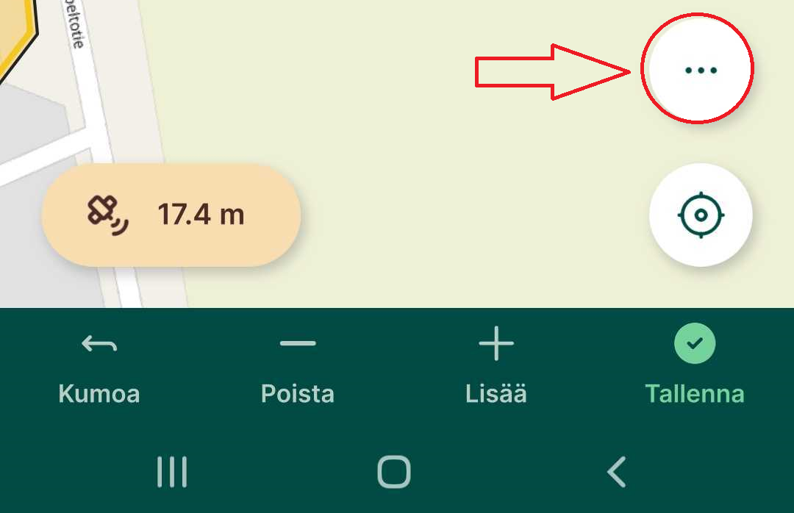
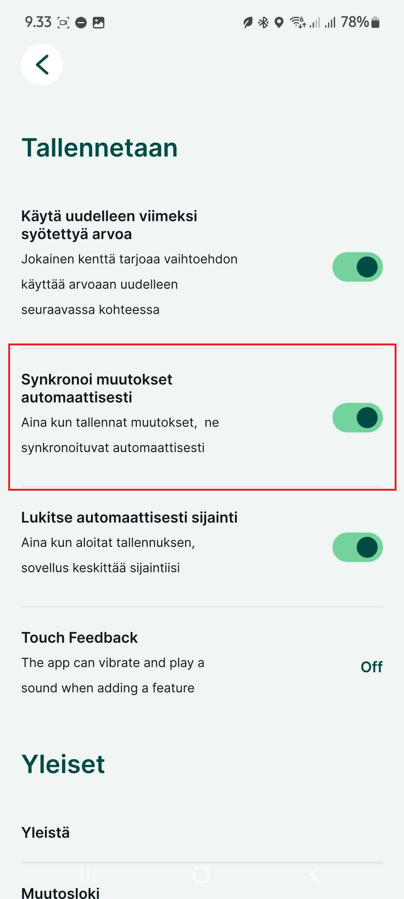
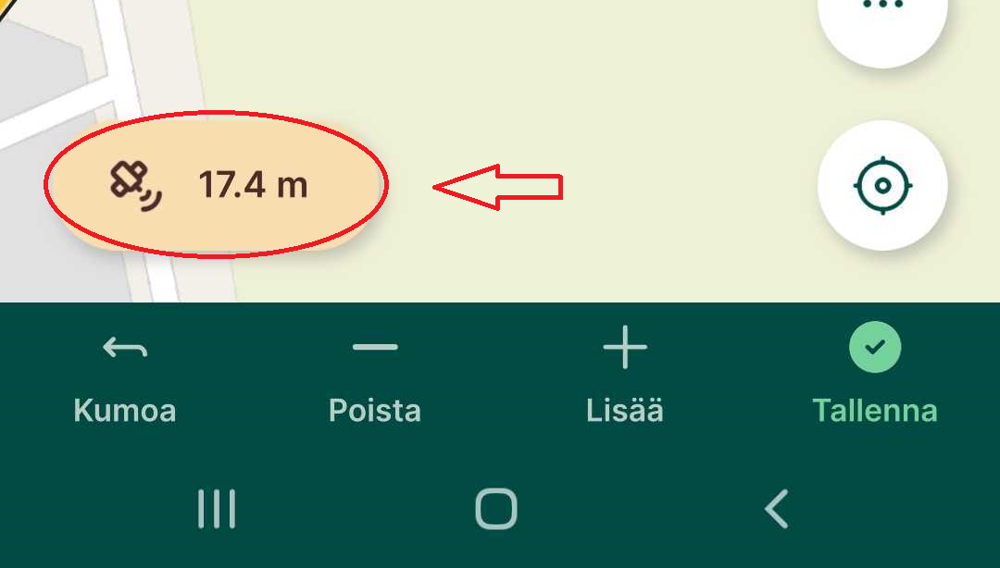

# Yleiset asetukset

## Kohteiden lisääminen, muokkaaminen ja poistaminen Mergin Maps -mobiilisovelluksessa

Mergin Maps -mobiilisovelluksella voit kenttätyössä **myös muokata** ja **poistaa kohteita**,

### Kohteiden muokkaaminen

-   Napauta haluamaasi kohdetta kartalta tai valikkolistasta ja valitse **Muokkaa** -painike ja **Muokkaa geometriaa** -painike siirtääksesi pisteitä

-   Kun valitset **Muokkaa geometriaa** kohteen solmupisteet korostuvat: niitä voi siirtää, poistaa tai muuttaa.

-   Tallenna muutokset napauttamalla

<iframe src="https://drive.google.com/file/d/1Imp0jJsL0mIW81oeoLPFExm07jGQ2z_j/preview" width="50%" height="900" allowfullscreen="allowfullscreen">

</iframe>

### Geometrian uudelleenpiirtäminen

-   Napauta haluamaasi kohdetta kartalta tai valikkolistasta ja valitse **Muokkaa** -painike muokataksesi ja **Muokkaa geometriaa** -painike.

-   Napauta **Lisäasetukset**-painiketta

    

-   ja valitse **Piirrä geometria uudelleen**, tee uusi piirto ja tallenna

<iframe src="https://drive.google.com/file/d/1MKbWQ7x2In4PGbVyNpPL6LcI1WTQxPSE/preview" width="50%" height="900" allowfullscreen="allowfullscreen">

</iframe>

### Useiden kohteiden muokkaus

-   Valitse ensin yksi kohde kartalta ja valitse sen jälkeen **Select more**-toiminto.

-   Valitse muut muokattavat kohteet ja avaa attribuuttikaavake. Anna uudet arvot ja tallenna -- kaikkien valittujen kohteiden attribuutit päivittyvät kerralla [merginmaps](https://merginmaps.com/docs/field/mobile-features/).

<iframe src="https://drive.google.com/file/d/1cchAqXyZig3_XLkGfCvVYfgQcMjofkKX/preview" width="50%" height="900" allowfullscreen="allowfullscreen">

</iframe>

### Kohteiden poistaminen

-   Valitse kohde kartalta tai listasta, avaa **muokkaa**-lomake ja napauta **Poista**-painiketta. Vahvista poisto, niin kohde poistuu

## Viimeksi syötettyjen arvojen uudelleenkäyttö

Voit nopeuttaa kenttätyössä samankaltaisten kohteiden syöttämistä ottamalla käyttöön viimeksi käyttämiäsi attribuuttiarvoja -- nämä kopioituvat automaattisesti seuraavaan kohteeseen.

### Miten otat ominaisuuden käyttöön:

3.  **Avaa valikko** napauttamalla kolmea pistettä (⋯) ja siirry kohtaan **Asetukset**

4.  **Ota käyttöön** valinta **"Viimeksi syötetyn arvon uudelleenkäyttö"**

### Miten se toimii käytännössä:

-   Kun olet ottanut ominaisuuden käyttöön, siirry takaisin karttanäkymään. Siinä vaiheessa, kun lisäät uuden kohteen, atribuuttien lomakkeessa näkyy **valintaruudut jokaisen kentän vieressä**.

-   Valitse ne attribuutit (esim. laji tms.), joiden arvon haluat kopioida viimeksi tallennetusta kohteesta.

-   Tallennettuasi kohteen, valitsemasi attribuuteille kopioituu **edellinen arvo** automaattisesti seuraavalla kohteella, kun taas muut kentät jäävät tyhjiksi.

## Pisteelle navigointi/merkintä kenttätyössä

Mergin Maps -sovellus ohjaa sinua valitsemaasi pisteeseen näyttämällä sekä suuntaan että etäisyyteen pisteestä -- mikä auttaa tarkassa kenttätyöskentelyssä.

### Navigointi mobiilisovelluksessa

1.  Avaa karttanäkymä ja **valitse haluamasi piste**.

2.  Avaa ominaisuuslomake ja napauta **Merkintä**-painiketta.

3.  Näet näkymän, jossa esitetään:

    -   Etäisyys nykyisestä sijainnistasi kohdepisteeseen.

    -   Viiva, joka yhdistää nykyisen sijaintisi ja pisteen.

    Tämä on **pitkän matkan navigointitila**

4.  Kun olet alle 1 metrin päässä pisteestä, näkymä vaihtuu automaattisesti **lyhyen matkan navigointitilaan**.

5.  Täsmällinen navigointi (alle 10 cm etäisyys) korostuu **vihreällä**, mikä auttaa tunnistamaan, että olet aivan kohdassa.

**Vinkki:** Jos haluat erittäin tarkan navigoinnin, kannattaa käyttää [ulkoista GPS-vastaanotinta](https://merginmaps.com/docs/field/external_gps/#list-of-known-supported-gps-devices), joka hyödyntää GPS-korjauksia.

## Mergin Mapsin synkronointi mobiilisovelluksessa

Mergin Maps-sovelluksella voit varmistaa, että tekemäsi kenttätyön muutokset synkronoituvat projektisi pilveen -- joko **manuaalisesti** tai **automaattisesti**.

### Perusedellytykset synkronointiin

-   Sinun täytyy olla **kirjautunut Mergin Maps-tilillesi**.

-   Laite tarvitsee **verkkoyhteyden** synkronointia varten.

-   Sinulla tulee olla projektiin **kirjoitusoikeudet**.

### 1. Manuaalinen synkronointi

-   Napauta karttanäkymässä olevaa **Sync-painiketta**.

-   Kun synkronointi on valmis, painike lakkaa pyörimästä ja näytölle ilmestyy ilmoitus: **Synkronoitu onnistuneesti**

-   Voit halutessasi tarkastella odottavia muutoksia napauttamalla **Lisää → Paikalliset muutokset** 

### 2. Automaattinen synkronointi

-   Siirry sovelluksen **Asetuksiin** ja ota käyttöön valinta **Synkronoi muutokset automaattisesti**

-   Tämän jälkeen Mergin Maps synkronoi tekemäsi muutokset (kuten kohteiden lisäykset tai muokkaukset) **automaattisesti**, kun muutoksia tapahtuu ja internet-yhteys on saatavilla.

-   Synkronoinnin eteneminen näkyy Synkronoi-painikkeen animaation kautta, ja onnistuneen synkronoinnin jälkeen ilmestyy ilmoitus "Synkronoitu onnistuneesti".

-   Jos internet-yhteys katkeaa synkronoinnin aikana, pysähtyy automaattinen synkronointi ja vaatii uuden yrityksen, kun yhteys palautuu

## GPS-tarkkuus Mergin Maps -mobiilisovelluksessa

Mergin Maps -sovellus näyttää reaaliaikaisen GPS-tarkkuuden, joka vaikuttaa suoraan kenttätyön paikkatietojen laatuun. Tarkkuus näkyy kartan alareunassa ja siihen liittyy värikoodattu ympyrä, joka havainnollistaa sijainnin arvioitua virhemarginaalia.

### Mistä näet GPS-tarkkuuden?

-   **Tarkkuusnäyttö** näkyy kartan **vasemmassa alakulmassa**.

    

-   **Väri** kertoo, onko tarkkuus asetetun raja-arvon sisällä (vihreä) vai ulkopuolella (oranssi).

-   **Värikoodin raja-arvo** määritetään sovelluksen GPS-asetuksissa (Oikea alakulman Lisää --\> Asetukset). Oletus on 10 metriä.

-   **Napauta tarkkuusnäyttöä** saadaksesi lisätietoja, kuten:

    -   Horisontaalinen ja vertikaalinen tarkkuus (HDOP, VDOP)

    -   Käytettävissä olevien satelliittien määrä

    -   GPS-antennin korkeus (jos määritetty)

    -   Viimeisin sijaintitieto

    ### Miten parannan GPS-tarkkuutta?

-   **Odota vakaata signaalia**: Jos tarkkuus on heikko, odota hetki, että laite saa paremman signaalin.

-   **Käytä ulkoista GPS-laitetta**: Liitä laitteesi Bluetoothin kautta ulkoiseen GPS-vastaanottimeen saadaksesi tarkempia mittauksia.

-   **Varmista esteetön taivasnäkyvyys**: GPS-signaali heikkenee esteiden, kuten rakennusten tai tiheän puuston, takia.
